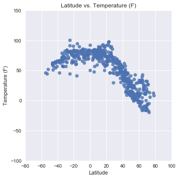
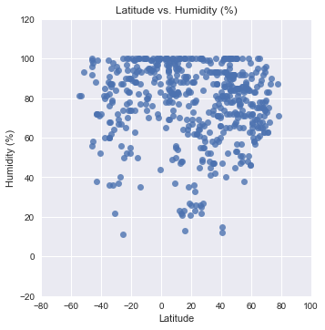
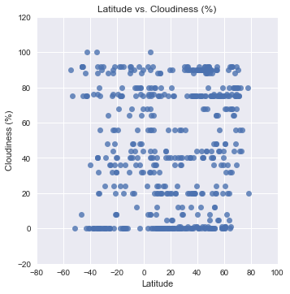
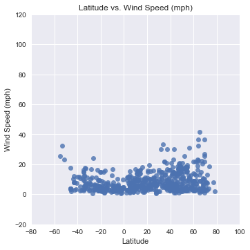

WeatherPy

In this example, you'll be creating a Python script to visualize the weather of 500+ cities across the world of varying distance from the equator. To accomplish this, you'll be utilizing a simple Python library, the OpenWeatherMap API, and a little common sense to create a representative model of weather across world cities.

City
Cloudiness
Country
Date
Humidity
Lat
Lng
Max Temp
Wind Speed

Your objective is to build a series of scatter plots to showcase the following relationships:

    Temperature (F) vs. Latitude
    Humidity (%) vs. Latitude
    Cloudiness (%) vs. Latitude
    Wind Speed (mph) vs. Latitude

Your final notebook must:

    Randomly select at least 500 unique (non-repeat) cities based on latitude and longitude.
    Perform a weather check on each of the cities using a series of successive API calls.
    Include a print log of each city as it's being processed with the city number, city name, and requested URL.
    Save both a CSV of all data retrieved and png images for each scatter plot.

As final considerations:

    You must use the Matplotlib and Seaborn libraries.
    You must include a written description of three observable trends based on the data.
    You must use proper labeling of your plots, including aspects like: Plot Titles (with date of analysis) and Axes Labels.
    You must include an exported markdown version of your Notebook called README.md in your GitHub repository.
    See Example Solution for a reference on expected format.


```python
# Dependencies
import pandas as pd
import numpy as np
import matplotlib.pyplot as plt
import random
import seaborn as sns
%matplotlib inline
import requests as req
import json
from citipy import citipy
```


```python
# Save config information.
api_key = "25bc90a1196e6f153eece0bc0b0fc9eb"
url = "http://api.openweathermap.org/data/2.5/weather?"
units = "imperial"


# Build partial query URL
query_url = url + "appid=" + api_key + "&units=" + units + "&q="
query_url
```


    'http://api.openweathermap.org/data/2.5/weather?appid=25bc90a1196e6f153eece0bc0b0fc9eb&units=imperial&q='


```python
lat=[]
lon=[]

for x in range(1500):
    #generate random lat
    s = random.uniform(-90,90)
    t = random.uniform(-180,180)
    lat.append(s)
    lon.append(t)
    
coordinates = zip(lat, lon)
        
cities=[]
for coordinate_pair in coordinates:
    lat, lon = coordinate_pair
    cities.append(citipy.nearest_city(lat, lon))
d=set(cities)
# d
newlist=[]    
for city in d:
    newlist.append(city.city_name)
newlist
```


    ['sinazongwe',
     'bathsheba',
     'kuche',
     'pandan',
     'zachagansk',
     'oriximina',
     'rocha',
     'zaysan',
     'beitbridge',
     'tres picos',
     'bagan',
     'conselheiro pena',
     'zhanaozen',
     'odweyne',
     'kaeng khoi',
     'daxian',
     'puerto colombia',
     'chinhoyi',
     'saint-joseph',
     'faya',
     'saleaula',
     'prachuap khiri khan',
     'arman',
     'kifri',
     'alofi',
     'segesd',
     'puerto escondido',
     'dayong',
     'ust-kan',
     'kalabo',
     'ranong',
     'ahipara',
     'taolanaro',
     'makueni',
     'gamba',
     'saint-philippe',
     'mys shmidta',
     'samusu',
     'kyshtovka',
     'dengzhou',
     'lompoc',
     'tsihombe',
     'khartoum',
     'hermanus',
     'lagoa',
     'sao miguel do araguaia',
     'bluff',
     'sinjar',
     'kropotkin',
     'lagos',
     'polunochnoye',
     'paris',
     'mosquera',
     'lasa',
     'caravelas',
     'tarauaca',
     'jieshi',
     'kutum',
     'vondrozo',
     'marsabit',
     'mayumba',
     'ust-nera',
     'christchurch',
     'guerrero negro',
     'westport',
     'la ronge',
     'itacare',
     'viransehir',
     'kupino',
     'adrar',
     'mana',
     'kuybysheve',
     'west bay',
     'verkhniye tatyshly',
     'san carlos de bariloche',
     'salalah',
     'nampula',
     'pochutla',
     'bahia honda',
     'khasan',
     'juxtlahuaca',
     'yokadouma',
     'achisay',
     'mehamn',
     'san policarpo',
     'martinsville',
     'takoradi',
     'brekstad',
     'khatanga',
     'oussouye',
     'alihe',
     'dingle',
     'beregovoy',
     'pevek',
     'taltal',
     'mount gambier',
     'synya',
     'cabedelo',
     'garissa',
     'sidney',
     'hilo',
     'sebring',
     'morgantown',
     'bengkulu',
     'gwadar',
     'verkhnyaya inta',
     'denpasar',
     'ponta do sol',
     'santa rosa',
     'kahului',
     'tuggurt',
     'mairana',
     'tokur',
     'anloga',
     'columbus',
     'negrar',
     'broken hill',
     'eirunepe',
     'grand forks',
     'broome',
     'ruteng',
     'kapaa',
     'sal rei',
     'dzilam gonzalez',
     'sao joao da barra',
     'sao filipe',
     'santa maria',
     'komsomolskiy',
     'tomari',
     'elat',
     'korhogo',
     'illoqqortoormiut',
     'axim',
     'cedar city',
     'cabo san lucas',
     'woodland',
     'ilulissat',
     'yaviza',
     'khorixas',
     'new norfolk',
     'peace river',
     'cherskiy',
     'arraial do cabo',
     'poum',
     'makhinjauri',
     'moses lake',
     'novyy svit',
     'coihaique',
     'kharan',
     'poya',
     'kastellion',
     'buin',
     'dikson',
     'sungaipenuh',
     'balimo',
     'kavaratti',
     'laguna',
     'hendijan',
     'bajo baudo',
     'komatipoort',
     'tlapehuala',
     'daru',
     'port alfred',
     'thio',
     'hobart',
     'sentyabrskiy',
     'chapada dos guimaraes',
     'takestan',
     'rabo de peixe',
     'hervey bay',
     'port elizabeth',
     'san-pedro',
     'constitucion',
     'darhan',
     'yacuiba',
     'yulara',
     'eureka',
     'portoferraio',
     'alice town',
     'lunguletu',
     'andenes',
     'coquimbo',
     'jaffna',
     'mandalgovi',
     'kalmunai',
     'kruisfontein',
     'bairiki',
     'moron',
     'kuruman',
     'ajdabiya',
     'kavieng',
     'tucuma',
     'vostok',
     'isangel',
     'butaritari',
     'high rock',
     'karratha',
     'awbari',
     'manzil tamim',
     'belaya gora',
     'acarau',
     'ulaangom',
     'cidreira',
     'marsh harbour',
     'richards bay',
     'alekseyevsk',
     'safaga',
     'chokurdakh',
     'sarkand',
     'yatou',
     'buqayq',
     'kiunga',
     'plyussa',
     'srednekolymsk',
     'ribeira grande',
     'louis trichardt',
     'chengde',
     'bardiyah',
     'tabiauea',
     'kiama',
     'barranquilla',
     'bilma',
     'kingaroy',
     'orje',
     'ca mau',
     'saldanha',
     'kenai',
     'louisbourg',
     'makakilo city',
     'maniitsoq',
     'ketchikan',
     'mongo',
     'rio claro',
     'itoman',
     'nanortalik',
     'kodiak',
     'manbij',
     'palabuhanratu',
     'narsaq',
     'los llanos de aridane',
     'turbat',
     'nizhneyansk',
     'mouzakion',
     'northam',
     'nuuk',
     'trat',
     'palmer',
     'sinop',
     'bandarbeyla',
     'bogorodskoye',
     'qaanaaq',
     'vila franca do campo',
     'sitka',
     'paamiut',
     'tuktoyaktuk',
     'bonthe',
     'bargal',
     'soldotna',
     'palmerston',
     'freeport',
     'yellowknife',
     'dongning',
     'ostrovnoy',
     'perth',
     'tuatapere',
     'arcachon',
     'ucluelet',
     'salamiyah',
     'sisimiut',
     'asau',
     'burica',
     'mahon',
     'lolua',
     'gazli',
     'tasiilaq',
     'yelyzavethradka',
     'lavrentiya',
     'upernavik',
     'attawapiskat',
     'lake charles',
     'aden',
     'minggang',
     'bredasdorp',
     'poplar bluff',
     'beisfjord',
     'portland',
     'port lincoln',
     'muros',
     'port macquarie',
     'klyuchi',
     'port-gentil',
     'shenjiamen',
     'atascadero',
     'san lawrenz',
     'pangkalanbuun',
     'rio grande',
     'taitung',
     'syracuse',
     'berlevag',
     'erzin',
     'constitucion',
     'maturin',
     'kegayli',
     'hargeysa',
     'waipawa',
     'kati',
     'roma',
     'cape town',
     'urumqi',
     'mar del plata',
     'hobyo',
     'kidal',
     'chute-aux-outardes',
     'luderitz',
     'shimoda',
     'ushuaia',
     'alytus',
     'ust-ordynskiy',
     'busselton',
     'chuy',
     'bolungarvik',
     'stornoway',
     'byron bay',
     'dalvik',
     'oskaloosa',
     'otautau',
     'estevan',
     'tezu',
     'viedma',
     'cairns',
     'clyde river',
     'grindavik',
     'owo',
     'chulym',
     'lebu',
     'bubaque',
     'pisco',
     'orsha',
     'isla',
     'shintomi',
     'talnakh',
     'hamilton',
     'carnarvon',
     'sargatskoye',
     'saint george',
     'hofn',
     'qianjiang',
     'ginda',
     'vlasenica',
     'badnawar',
     'halifax',
     'haines junction',
     'husavik',
     'joao pinheiro',
     'oranjemund',
     'yerbogachen',
     'lucatan',
     'maldonado',
     'islahiye',
     'saskylakh',
     'olafsvik',
     'qingyuan',
     'dalmatovo',
     'villaviciosa',
     'stoyba',
     'malwan',
     'hami',
     'tual',
     'yerofey pavlovich',
     'eydhafushi',
     'mistrato',
     'akdepe',
     'baoning',
     'tawkar',
     'saint-pierre',
     'sobolevo',
     'motygino',
     'vestmannaeyjar',
     'mulchen',
     'hithadhoo',
     'chagda',
     'kahramanmaras',
     'balkanabat',
     'fort saint john',
     'kudahuvadhoo',
     'aubiere',
     'kununurra',
     'nago',
     'gat',
     'klaksvik',
     'pasighat',
     'sulangan',
     'caconda',
     'xiashi',
     'monroe',
     'atuona',
     'codrington',
     'jiuquan',
     'avarua',
     'avera',
     'beloha',
     'el alto',
     'mykolayivka',
     'lorengau',
     'lakes entrance',
     'urusha',
     'faanui',
     'kitimat',
     'skibbereen',
     'la ciotat',
     'zemio',
     'port victoria',
     'puerto ayora',
     'les cayes',
     'mizdah',
     'the valley',
     'grand gaube',
     'grand river south east',
     'san carlos del zulia',
     'peleduy',
     'sabha',
     'bulle',
     'omsukchan',
     'loandjili',
     'halol',
     'mackay',
     'port moresby',
     'vestmanna',
     'acapulco',
     'surman',
     'east london',
     'bozdar',
     'palamos',
     'venice',
     'bilibino',
     'samarai',
     'tateyama',
     'albany',
     'mareeba',
     'sept-iles',
     'muravlenko',
     'boa vista',
     'vite',
     'mataura',
     'mahebourg',
     'hasaki',
     'san cristobal',
     'cayenne',
     'alyangula',
     'mirskoy',
     'tiksi',
     'krasnoselkup',
     'korla',
     'iracoubo',
     'wau',
     'peniche',
     'tilichiki',
     'huarmey',
     'tromso',
     'castro',
     'nikolayevka',
     'atkarsk',
     'fortuna',
     'kulhudhuffushi',
     'gua musang',
     'ixtapa',
     'mahibadhoo',
     'kendari',
     'hanzhong',
     'umm kaddadah',
     'uppsala',
     'tumannyy',
     'leningradskiy',
     'garden city',
     'alugan',
     'marcona',
     'vaitupu',
     'muli',
     'fomboni',
     'ciudad bolivar',
     'panalingaan',
     'arrah',
     'ngaoundere',
     'kamenskoye',
     'yar-sale',
     'sakakah',
     'ambam',
     'manzanillo',
     'saint anthony',
     'ayame',
     'mayo',
     'saint-augustin',
     'rikitea',
     'turan',
     'dauphin',
     'fevralsk',
     'novo aripuana',
     'zhuhai',
     'tura',
     'cochabamba',
     'esperance',
     'san calixto',
     'flinders',
     'atar',
     'catuday',
     'umm lajj',
     'guhagar',
     'katsuura',
     'mendahara',
     'jumla',
     'bondoukou',
     'auki',
     'lensk',
     'tiarei',
     'okhotsk',
     'castlecomer',
     'san patricio',
     'georgetown',
     'nikolskoye',
     'severo-kurilsk',
     'nouadhibou',
     'banda aceh',
     'jamestown',
     'uirauna',
     'honiara',
     'nouakchott',
     'hobbs',
     'bradford',
     'provideniya',
     'mori',
     'kirakira',
     'geraldton',
     'belushya guba',
     'kupang',
     'san quintin',
     'tamandare',
     'meulaboh',
     'pulaski',
     'doha',
     'victoria',
     'dolbeau',
     'roald',
     'labuhan',
     'barkly west',
     'alotau',
     'walvis bay',
     'farafenni',
     'margate',
     'waingapu',
     'portsmouth',
     'west wendover',
     'mae hong son',
     'airai',
     'barentsburg',
     'port hardy',
     'kaitangata',
     'wanning',
     'longyearbyen',
     'port hawkesbury',
     'wattegama',
     'meyungs',
     'bourail',
     'namibe',
     'ozinki',
     'paragominas',
     'high level',
     'buta',
     'sioux lookout',
     'ponta delgada',
     'izazi',
     'batagay',
     'palana',
     'svetlaya',
     'powell river',
     'ponta do sol',
     'usevya',
     'berndorf',
     'sendhwa',
     'svetlogorsk',
     'aklavik',
     'nioro',
     'sumbe',
     'albanel',
     'thompson',
     'shvartsevskiy',
     'punta arenas',
     'leona vicario',
     'inhambane',
     'natal',
     'quang ngai',
     'itarema',
     'barrow',
     'touros',
     'rawson',
     'bethel',
     'san felipe',
     'deputatskiy',
     'egvekinot',
     'rockingham',
     'trairi',
     'fairbanks',
     'siare',
     'tessalit',
     'saint-amand-les-eaux',
     'vardo',
     'muzquiz',
     'parabel',
     'rio gallegos',
     'vaini',
     'adzhamka',
     'merrill',
     'te anau',
     'zyryanka',
     'torbay',
     'amderma',
     'juneau',
     'inuvik',
     'concepcion del uruguay']


```python
len(newlist)
```


    618


```python
type(newlist)
```


    list


```python
# Test first city to see if url will print
params = {"appid": api_key,
          "q": newlist[0],
         "units": "imperial"}
weather_response = req.get(url,params=params)
weather_response.url
```


    'http://api.openweathermap.org/data/2.5/weather?appid=25bc90a1196e6f153eece0bc0b0fc9eb&q=sinazongwe&units=imperial'


```python
responses=[]

for city in newlist:
    params = {"appid": api_key,
          "q": city,
         "units": "imperial"}
    weather_response = req.get(url,params=params)
    print(weather_response.url)
    weather_json = weather_response.json()
    if weather_json['cod']=='404':
        del(city)
    else:
        responses.append(weather_json)
# responses
```

    http://api.openweathermap.org/data/2.5/weather?appid=25bc90a1196e6f153eece0bc0b0fc9eb&q=sinazongwe&units=imperial
    http://api.openweathermap.org/data/2.5/weather?appid=25bc90a1196e6f153eece0bc0b0fc9eb&q=bathsheba&units=imperial
    http://api.openweathermap.org/data/2.5/weather?appid=25bc90a1196e6f153eece0bc0b0fc9eb&q=kuche&units=imperial
    http://api.openweathermap.org/data/2.5/weather?appid=25bc90a1196e6f153eece0bc0b0fc9eb&q=pandan&units=imperial
    http://api.openweathermap.org/data/2.5/weather?appid=25bc90a1196e6f153eece0bc0b0fc9eb&q=zachagansk&units=imperial
    http://api.openweathermap.org/data/2.5/weather?appid=25bc90a1196e6f153eece0bc0b0fc9eb&q=oriximina&units=imperial
    http://api.openweathermap.org/data/2.5/weather?appid=25bc90a1196e6f153eece0bc0b0fc9eb&q=rocha&units=imperial
    http://api.openweathermap.org/data/2.5/weather?appid=25bc90a1196e6f153eece0bc0b0fc9eb&q=zaysan&units=imperial
    http://api.openweathermap.org/data/2.5/weather?appid=25bc90a1196e6f153eece0bc0b0fc9eb&q=beitbridge&units=imperial
    http://api.openweathermap.org/data/2.5/weather?appid=25bc90a1196e6f153eece0bc0b0fc9eb&q=tres+picos&units=imperial
    http://api.openweathermap.org/data/2.5/weather?appid=25bc90a1196e6f153eece0bc0b0fc9eb&q=bagan&units=imperial
    http://api.openweathermap.org/data/2.5/weather?appid=25bc90a1196e6f153eece0bc0b0fc9eb&q=conselheiro+pena&units=imperial
    http://api.openweathermap.org/data/2.5/weather?appid=25bc90a1196e6f153eece0bc0b0fc9eb&q=zhanaozen&units=imperial
    http://api.openweathermap.org/data/2.5/weather?appid=25bc90a1196e6f153eece0bc0b0fc9eb&q=odweyne&units=imperial
    http://api.openweathermap.org/data/2.5/weather?appid=25bc90a1196e6f153eece0bc0b0fc9eb&q=kaeng+khoi&units=imperial
    http://api.openweathermap.org/data/2.5/weather?appid=25bc90a1196e6f153eece0bc0b0fc9eb&q=daxian&units=imperial
    http://api.openweathermap.org/data/2.5/weather?appid=25bc90a1196e6f153eece0bc0b0fc9eb&q=puerto+colombia&units=imperial
    http://api.openweathermap.org/data/2.5/weather?appid=25bc90a1196e6f153eece0bc0b0fc9eb&q=chinhoyi&units=imperial
    http://api.openweathermap.org/data/2.5/weather?appid=25bc90a1196e6f153eece0bc0b0fc9eb&q=saint-joseph&units=imperial
    http://api.openweathermap.org/data/2.5/weather?appid=25bc90a1196e6f153eece0bc0b0fc9eb&q=faya&units=imperial
    http://api.openweathermap.org/data/2.5/weather?appid=25bc90a1196e6f153eece0bc0b0fc9eb&q=saleaula&units=imperial
    http://api.openweathermap.org/data/2.5/weather?appid=25bc90a1196e6f153eece0bc0b0fc9eb&q=prachuap+khiri+khan&units=imperial
    http://api.openweathermap.org/data/2.5/weather?appid=25bc90a1196e6f153eece0bc0b0fc9eb&q=arman&units=imperial
    http://api.openweathermap.org/data/2.5/weather?appid=25bc90a1196e6f153eece0bc0b0fc9eb&q=kifri&units=imperial
    http://api.openweathermap.org/data/2.5/weather?appid=25bc90a1196e6f153eece0bc0b0fc9eb&q=alofi&units=imperial
    http://api.openweathermap.org/data/2.5/weather?appid=25bc90a1196e6f153eece0bc0b0fc9eb&q=segesd&units=imperial
    http://api.openweathermap.org/data/2.5/weather?appid=25bc90a1196e6f153eece0bc0b0fc9eb&q=puerto+escondido&units=imperial
    http://api.openweathermap.org/data/2.5/weather?appid=25bc90a1196e6f153eece0bc0b0fc9eb&q=dayong&units=imperial
    http://api.openweathermap.org/data/2.5/weather?appid=25bc90a1196e6f153eece0bc0b0fc9eb&q=ust-kan&units=imperial
    http://api.openweathermap.org/data/2.5/weather?appid=25bc90a1196e6f153eece0bc0b0fc9eb&q=kalabo&units=imperial
    http://api.openweathermap.org/data/2.5/weather?appid=25bc90a1196e6f153eece0bc0b0fc9eb&q=ranong&units=imperial
    http://api.openweathermap.org/data/2.5/weather?appid=25bc90a1196e6f153eece0bc0b0fc9eb&q=ahipara&units=imperial
    http://api.openweathermap.org/data/2.5/weather?appid=25bc90a1196e6f153eece0bc0b0fc9eb&q=taolanaro&units=imperial
    http://api.openweathermap.org/data/2.5/weather?appid=25bc90a1196e6f153eece0bc0b0fc9eb&q=makueni&units=imperial
    http://api.openweathermap.org/data/2.5/weather?appid=25bc90a1196e6f153eece0bc0b0fc9eb&q=gamba&units=imperial
    http://api.openweathermap.org/data/2.5/weather?appid=25bc90a1196e6f153eece0bc0b0fc9eb&q=saint-philippe&units=imperial
    http://api.openweathermap.org/data/2.5/weather?appid=25bc90a1196e6f153eece0bc0b0fc9eb&q=mys+shmidta&units=imperial
    http://api.openweathermap.org/data/2.5/weather?appid=25bc90a1196e6f153eece0bc0b0fc9eb&q=samusu&units=imperial
    http://api.openweathermap.org/data/2.5/weather?appid=25bc90a1196e6f153eece0bc0b0fc9eb&q=kyshtovka&units=imperial
    http://api.openweathermap.org/data/2.5/weather?appid=25bc90a1196e6f153eece0bc0b0fc9eb&q=dengzhou&units=imperial
    http://api.openweathermap.org/data/2.5/weather?appid=25bc90a1196e6f153eece0bc0b0fc9eb&q=lompoc&units=imperial
    http://api.openweathermap.org/data/2.5/weather?appid=25bc90a1196e6f153eece0bc0b0fc9eb&q=tsihombe&units=imperial
    http://api.openweathermap.org/data/2.5/weather?appid=25bc90a1196e6f153eece0bc0b0fc9eb&q=khartoum&units=imperial
    http://api.openweathermap.org/data/2.5/weather?appid=25bc90a1196e6f153eece0bc0b0fc9eb&q=hermanus&units=imperial
    http://api.openweathermap.org/data/2.5/weather?appid=25bc90a1196e6f153eece0bc0b0fc9eb&q=lagoa&units=imperial
    http://api.openweathermap.org/data/2.5/weather?appid=25bc90a1196e6f153eece0bc0b0fc9eb&q=sao+miguel+do+araguaia&units=imperial
    http://api.openweathermap.org/data/2.5/weather?appid=25bc90a1196e6f153eece0bc0b0fc9eb&q=bluff&units=imperial
    http://api.openweathermap.org/data/2.5/weather?appid=25bc90a1196e6f153eece0bc0b0fc9eb&q=sinjar&units=imperial
    http://api.openweathermap.org/data/2.5/weather?appid=25bc90a1196e6f153eece0bc0b0fc9eb&q=kropotkin&units=imperial
    http://api.openweathermap.org/data/2.5/weather?appid=25bc90a1196e6f153eece0bc0b0fc9eb&q=lagos&units=imperial
    http://api.openweathermap.org/data/2.5/weather?appid=25bc90a1196e6f153eece0bc0b0fc9eb&q=polunochnoye&units=imperial
    http://api.openweathermap.org/data/2.5/weather?appid=25bc90a1196e6f153eece0bc0b0fc9eb&q=paris&units=imperial
    http://api.openweathermap.org/data/2.5/weather?appid=25bc90a1196e6f153eece0bc0b0fc9eb&q=mosquera&units=imperial
    http://api.openweathermap.org/data/2.5/weather?appid=25bc90a1196e6f153eece0bc0b0fc9eb&q=lasa&units=imperial
    http://api.openweathermap.org/data/2.5/weather?appid=25bc90a1196e6f153eece0bc0b0fc9eb&q=caravelas&units=imperial
    http://api.openweathermap.org/data/2.5/weather?appid=25bc90a1196e6f153eece0bc0b0fc9eb&q=tarauaca&units=imperial
    http://api.openweathermap.org/data/2.5/weather?appid=25bc90a1196e6f153eece0bc0b0fc9eb&q=jieshi&units=imperial
    http://api.openweathermap.org/data/2.5/weather?appid=25bc90a1196e6f153eece0bc0b0fc9eb&q=kutum&units=imperial
    http://api.openweathermap.org/data/2.5/weather?appid=25bc90a1196e6f153eece0bc0b0fc9eb&q=vondrozo&units=imperial
    http://api.openweathermap.org/data/2.5/weather?appid=25bc90a1196e6f153eece0bc0b0fc9eb&q=marsabit&units=imperial
    http://api.openweathermap.org/data/2.5/weather?appid=25bc90a1196e6f153eece0bc0b0fc9eb&q=mayumba&units=imperial
    http://api.openweathermap.org/data/2.5/weather?appid=25bc90a1196e6f153eece0bc0b0fc9eb&q=ust-nera&units=imperial
    http://api.openweathermap.org/data/2.5/weather?appid=25bc90a1196e6f153eece0bc0b0fc9eb&q=christchurch&units=imperial
    http://api.openweathermap.org/data/2.5/weather?appid=25bc90a1196e6f153eece0bc0b0fc9eb&q=guerrero+negro&units=imperial
    http://api.openweathermap.org/data/2.5/weather?appid=25bc90a1196e6f153eece0bc0b0fc9eb&q=westport&units=imperial
    http://api.openweathermap.org/data/2.5/weather?appid=25bc90a1196e6f153eece0bc0b0fc9eb&q=la+ronge&units=imperial
    http://api.openweathermap.org/data/2.5/weather?appid=25bc90a1196e6f153eece0bc0b0fc9eb&q=itacare&units=imperial
    http://api.openweathermap.org/data/2.5/weather?appid=25bc90a1196e6f153eece0bc0b0fc9eb&q=viransehir&units=imperial
    http://api.openweathermap.org/data/2.5/weather?appid=25bc90a1196e6f153eece0bc0b0fc9eb&q=kupino&units=imperial
    http://api.openweathermap.org/data/2.5/weather?appid=25bc90a1196e6f153eece0bc0b0fc9eb&q=adrar&units=imperial
    http://api.openweathermap.org/data/2.5/weather?appid=25bc90a1196e6f153eece0bc0b0fc9eb&q=mana&units=imperial
    http://api.openweathermap.org/data/2.5/weather?appid=25bc90a1196e6f153eece0bc0b0fc9eb&q=kuybysheve&units=imperial
    http://api.openweathermap.org/data/2.5/weather?appid=25bc90a1196e6f153eece0bc0b0fc9eb&q=west+bay&units=imperial
    http://api.openweathermap.org/data/2.5/weather?appid=25bc90a1196e6f153eece0bc0b0fc9eb&q=verkhniye+tatyshly&units=imperial
    http://api.openweathermap.org/data/2.5/weather?appid=25bc90a1196e6f153eece0bc0b0fc9eb&q=san+carlos+de+bariloche&units=imperial
    http://api.openweathermap.org/data/2.5/weather?appid=25bc90a1196e6f153eece0bc0b0fc9eb&q=salalah&units=imperial
    http://api.openweathermap.org/data/2.5/weather?appid=25bc90a1196e6f153eece0bc0b0fc9eb&q=nampula&units=imperial
    http://api.openweathermap.org/data/2.5/weather?appid=25bc90a1196e6f153eece0bc0b0fc9eb&q=pochutla&units=imperial
    http://api.openweathermap.org/data/2.5/weather?appid=25bc90a1196e6f153eece0bc0b0fc9eb&q=bahia+honda&units=imperial
    http://api.openweathermap.org/data/2.5/weather?appid=25bc90a1196e6f153eece0bc0b0fc9eb&q=khasan&units=imperial
    http://api.openweathermap.org/data/2.5/weather?appid=25bc90a1196e6f153eece0bc0b0fc9eb&q=juxtlahuaca&units=imperial
    http://api.openweathermap.org/data/2.5/weather?appid=25bc90a1196e6f153eece0bc0b0fc9eb&q=yokadouma&units=imperial
    http://api.openweathermap.org/data/2.5/weather?appid=25bc90a1196e6f153eece0bc0b0fc9eb&q=achisay&units=imperial
    http://api.openweathermap.org/data/2.5/weather?appid=25bc90a1196e6f153eece0bc0b0fc9eb&q=mehamn&units=imperial
    http://api.openweathermap.org/data/2.5/weather?appid=25bc90a1196e6f153eece0bc0b0fc9eb&q=san+policarpo&units=imperial
    http://api.openweathermap.org/data/2.5/weather?appid=25bc90a1196e6f153eece0bc0b0fc9eb&q=martinsville&units=imperial
    http://api.openweathermap.org/data/2.5/weather?appid=25bc90a1196e6f153eece0bc0b0fc9eb&q=takoradi&units=imperial
    http://api.openweathermap.org/data/2.5/weather?appid=25bc90a1196e6f153eece0bc0b0fc9eb&q=brekstad&units=imperial
    http://api.openweathermap.org/data/2.5/weather?appid=25bc90a1196e6f153eece0bc0b0fc9eb&q=khatanga&units=imperial
    http://api.openweathermap.org/data/2.5/weather?appid=25bc90a1196e6f153eece0bc0b0fc9eb&q=oussouye&units=imperial
    http://api.openweathermap.org/data/2.5/weather?appid=25bc90a1196e6f153eece0bc0b0fc9eb&q=alihe&units=imperial
    http://api.openweathermap.org/data/2.5/weather?appid=25bc90a1196e6f153eece0bc0b0fc9eb&q=dingle&units=imperial
    http://api.openweathermap.org/data/2.5/weather?appid=25bc90a1196e6f153eece0bc0b0fc9eb&q=beregovoy&units=imperial
    http://api.openweathermap.org/data/2.5/weather?appid=25bc90a1196e6f153eece0bc0b0fc9eb&q=pevek&units=imperial
    http://api.openweathermap.org/data/2.5/weather?appid=25bc90a1196e6f153eece0bc0b0fc9eb&q=taltal&units=imperial
    http://api.openweathermap.org/data/2.5/weather?appid=25bc90a1196e6f153eece0bc0b0fc9eb&q=mount+gambier&units=imperial
    http://api.openweathermap.org/data/2.5/weather?appid=25bc90a1196e6f153eece0bc0b0fc9eb&q=synya&units=imperial
    http://api.openweathermap.org/data/2.5/weather?appid=25bc90a1196e6f153eece0bc0b0fc9eb&q=cabedelo&units=imperial
    http://api.openweathermap.org/data/2.5/weather?appid=25bc90a1196e6f153eece0bc0b0fc9eb&q=garissa&units=imperial
    http://api.openweathermap.org/data/2.5/weather?appid=25bc90a1196e6f153eece0bc0b0fc9eb&q=sidney&units=imperial
    http://api.openweathermap.org/data/2.5/weather?appid=25bc90a1196e6f153eece0bc0b0fc9eb&q=hilo&units=imperial
    http://api.openweathermap.org/data/2.5/weather?appid=25bc90a1196e6f153eece0bc0b0fc9eb&q=sebring&units=imperial
    http://api.openweathermap.org/data/2.5/weather?appid=25bc90a1196e6f153eece0bc0b0fc9eb&q=morgantown&units=imperial
    http://api.openweathermap.org/data/2.5/weather?appid=25bc90a1196e6f153eece0bc0b0fc9eb&q=bengkulu&units=imperial
    http://api.openweathermap.org/data/2.5/weather?appid=25bc90a1196e6f153eece0bc0b0fc9eb&q=gwadar&units=imperial
    http://api.openweathermap.org/data/2.5/weather?appid=25bc90a1196e6f153eece0bc0b0fc9eb&q=verkhnyaya+inta&units=imperial
    http://api.openweathermap.org/data/2.5/weather?appid=25bc90a1196e6f153eece0bc0b0fc9eb&q=denpasar&units=imperial
    http://api.openweathermap.org/data/2.5/weather?appid=25bc90a1196e6f153eece0bc0b0fc9eb&q=ponta+do+sol&units=imperial
    http://api.openweathermap.org/data/2.5/weather?appid=25bc90a1196e6f153eece0bc0b0fc9eb&q=santa+rosa&units=imperial
    http://api.openweathermap.org/data/2.5/weather?appid=25bc90a1196e6f153eece0bc0b0fc9eb&q=kahului&units=imperial
    http://api.openweathermap.org/data/2.5/weather?appid=25bc90a1196e6f153eece0bc0b0fc9eb&q=tuggurt&units=imperial
    http://api.openweathermap.org/data/2.5/weather?appid=25bc90a1196e6f153eece0bc0b0fc9eb&q=mairana&units=imperial
    http://api.openweathermap.org/data/2.5/weather?appid=25bc90a1196e6f153eece0bc0b0fc9eb&q=tokur&units=imperial
    http://api.openweathermap.org/data/2.5/weather?appid=25bc90a1196e6f153eece0bc0b0fc9eb&q=anloga&units=imperial
    http://api.openweathermap.org/data/2.5/weather?appid=25bc90a1196e6f153eece0bc0b0fc9eb&q=columbus&units=imperial
    http://api.openweathermap.org/data/2.5/weather?appid=25bc90a1196e6f153eece0bc0b0fc9eb&q=negrar&units=imperial
    http://api.openweathermap.org/data/2.5/weather?appid=25bc90a1196e6f153eece0bc0b0fc9eb&q=broken+hill&units=imperial
    http://api.openweathermap.org/data/2.5/weather?appid=25bc90a1196e6f153eece0bc0b0fc9eb&q=eirunepe&units=imperial
    http://api.openweathermap.org/data/2.5/weather?appid=25bc90a1196e6f153eece0bc0b0fc9eb&q=grand+forks&units=imperial
    http://api.openweathermap.org/data/2.5/weather?appid=25bc90a1196e6f153eece0bc0b0fc9eb&q=broome&units=imperial
    http://api.openweathermap.org/data/2.5/weather?appid=25bc90a1196e6f153eece0bc0b0fc9eb&q=ruteng&units=imperial
    http://api.openweathermap.org/data/2.5/weather?appid=25bc90a1196e6f153eece0bc0b0fc9eb&q=kapaa&units=imperial
    http://api.openweathermap.org/data/2.5/weather?appid=25bc90a1196e6f153eece0bc0b0fc9eb&q=sal+rei&units=imperial
    http://api.openweathermap.org/data/2.5/weather?appid=25bc90a1196e6f153eece0bc0b0fc9eb&q=dzilam+gonzalez&units=imperial
    http://api.openweathermap.org/data/2.5/weather?appid=25bc90a1196e6f153eece0bc0b0fc9eb&q=sao+joao+da+barra&units=imperial
    http://api.openweathermap.org/data/2.5/weather?appid=25bc90a1196e6f153eece0bc0b0fc9eb&q=sao+filipe&units=imperial
    http://api.openweathermap.org/data/2.5/weather?appid=25bc90a1196e6f153eece0bc0b0fc9eb&q=santa+maria&units=imperial
    http://api.openweathermap.org/data/2.5/weather?appid=25bc90a1196e6f153eece0bc0b0fc9eb&q=komsomolskiy&units=imperial
    http://api.openweathermap.org/data/2.5/weather?appid=25bc90a1196e6f153eece0bc0b0fc9eb&q=tomari&units=imperial
    http://api.openweathermap.org/data/2.5/weather?appid=25bc90a1196e6f153eece0bc0b0fc9eb&q=elat&units=imperial
    http://api.openweathermap.org/data/2.5/weather?appid=25bc90a1196e6f153eece0bc0b0fc9eb&q=korhogo&units=imperial
    http://api.openweathermap.org/data/2.5/weather?appid=25bc90a1196e6f153eece0bc0b0fc9eb&q=illoqqortoormiut&units=imperial
    http://api.openweathermap.org/data/2.5/weather?appid=25bc90a1196e6f153eece0bc0b0fc9eb&q=axim&units=imperial
    http://api.openweathermap.org/data/2.5/weather?appid=25bc90a1196e6f153eece0bc0b0fc9eb&q=cedar+city&units=imperial
    http://api.openweathermap.org/data/2.5/weather?appid=25bc90a1196e6f153eece0bc0b0fc9eb&q=cabo+san+lucas&units=imperial
    http://api.openweathermap.org/data/2.5/weather?appid=25bc90a1196e6f153eece0bc0b0fc9eb&q=woodland&units=imperial
    http://api.openweathermap.org/data/2.5/weather?appid=25bc90a1196e6f153eece0bc0b0fc9eb&q=ilulissat&units=imperial
    http://api.openweathermap.org/data/2.5/weather?appid=25bc90a1196e6f153eece0bc0b0fc9eb&q=yaviza&units=imperial
    http://api.openweathermap.org/data/2.5/weather?appid=25bc90a1196e6f153eece0bc0b0fc9eb&q=khorixas&units=imperial
    http://api.openweathermap.org/data/2.5/weather?appid=25bc90a1196e6f153eece0bc0b0fc9eb&q=new+norfolk&units=imperial
    http://api.openweathermap.org/data/2.5/weather?appid=25bc90a1196e6f153eece0bc0b0fc9eb&q=peace+river&units=imperial
    http://api.openweathermap.org/data/2.5/weather?appid=25bc90a1196e6f153eece0bc0b0fc9eb&q=cherskiy&units=imperial
    http://api.openweathermap.org/data/2.5/weather?appid=25bc90a1196e6f153eece0bc0b0fc9eb&q=arraial+do+cabo&units=imperial
    http://api.openweathermap.org/data/2.5/weather?appid=25bc90a1196e6f153eece0bc0b0fc9eb&q=poum&units=imperial
    http://api.openweathermap.org/data/2.5/weather?appid=25bc90a1196e6f153eece0bc0b0fc9eb&q=makhinjauri&units=imperial
    http://api.openweathermap.org/data/2.5/weather?appid=25bc90a1196e6f153eece0bc0b0fc9eb&q=moses+lake&units=imperial
    http://api.openweathermap.org/data/2.5/weather?appid=25bc90a1196e6f153eece0bc0b0fc9eb&q=novyy+svit&units=imperial
    http://api.openweathermap.org/data/2.5/weather?appid=25bc90a1196e6f153eece0bc0b0fc9eb&q=coihaique&units=imperial
    http://api.openweathermap.org/data/2.5/weather?appid=25bc90a1196e6f153eece0bc0b0fc9eb&q=kharan&units=imperial
    http://api.openweathermap.org/data/2.5/weather?appid=25bc90a1196e6f153eece0bc0b0fc9eb&q=poya&units=imperial
    http://api.openweathermap.org/data/2.5/weather?appid=25bc90a1196e6f153eece0bc0b0fc9eb&q=kastellion&units=imperial
    http://api.openweathermap.org/data/2.5/weather?appid=25bc90a1196e6f153eece0bc0b0fc9eb&q=buin&units=imperial
    http://api.openweathermap.org/data/2.5/weather?appid=25bc90a1196e6f153eece0bc0b0fc9eb&q=dikson&units=imperial
    http://api.openweathermap.org/data/2.5/weather?appid=25bc90a1196e6f153eece0bc0b0fc9eb&q=sungaipenuh&units=imperial
    http://api.openweathermap.org/data/2.5/weather?appid=25bc90a1196e6f153eece0bc0b0fc9eb&q=balimo&units=imperial
    http://api.openweathermap.org/data/2.5/weather?appid=25bc90a1196e6f153eece0bc0b0fc9eb&q=kavaratti&units=imperial
    http://api.openweathermap.org/data/2.5/weather?appid=25bc90a1196e6f153eece0bc0b0fc9eb&q=laguna&units=imperial
    http://api.openweathermap.org/data/2.5/weather?appid=25bc90a1196e6f153eece0bc0b0fc9eb&q=hendijan&units=imperial
    http://api.openweathermap.org/data/2.5/weather?appid=25bc90a1196e6f153eece0bc0b0fc9eb&q=bajo+baudo&units=imperial
    http://api.openweathermap.org/data/2.5/weather?appid=25bc90a1196e6f153eece0bc0b0fc9eb&q=komatipoort&units=imperial
    http://api.openweathermap.org/data/2.5/weather?appid=25bc90a1196e6f153eece0bc0b0fc9eb&q=tlapehuala&units=imperial
    http://api.openweathermap.org/data/2.5/weather?appid=25bc90a1196e6f153eece0bc0b0fc9eb&q=daru&units=imperial
    http://api.openweathermap.org/data/2.5/weather?appid=25bc90a1196e6f153eece0bc0b0fc9eb&q=port+alfred&units=imperial
    http://api.openweathermap.org/data/2.5/weather?appid=25bc90a1196e6f153eece0bc0b0fc9eb&q=thio&units=imperial
    http://api.openweathermap.org/data/2.5/weather?appid=25bc90a1196e6f153eece0bc0b0fc9eb&q=hobart&units=imperial
    http://api.openweathermap.org/data/2.5/weather?appid=25bc90a1196e6f153eece0bc0b0fc9eb&q=sentyabrskiy&units=imperial
    http://api.openweathermap.org/data/2.5/weather?appid=25bc90a1196e6f153eece0bc0b0fc9eb&q=chapada+dos+guimaraes&units=imperial
    http://api.openweathermap.org/data/2.5/weather?appid=25bc90a1196e6f153eece0bc0b0fc9eb&q=takestan&units=imperial
    http://api.openweathermap.org/data/2.5/weather?appid=25bc90a1196e6f153eece0bc0b0fc9eb&q=rabo+de+peixe&units=imperial
    http://api.openweathermap.org/data/2.5/weather?appid=25bc90a1196e6f153eece0bc0b0fc9eb&q=hervey+bay&units=imperial
    http://api.openweathermap.org/data/2.5/weather?appid=25bc90a1196e6f153eece0bc0b0fc9eb&q=port+elizabeth&units=imperial
    http://api.openweathermap.org/data/2.5/weather?appid=25bc90a1196e6f153eece0bc0b0fc9eb&q=san-pedro&units=imperial
    http://api.openweathermap.org/data/2.5/weather?appid=25bc90a1196e6f153eece0bc0b0fc9eb&q=constitucion&units=imperial
    http://api.openweathermap.org/data/2.5/weather?appid=25bc90a1196e6f153eece0bc0b0fc9eb&q=darhan&units=imperial
    http://api.openweathermap.org/data/2.5/weather?appid=25bc90a1196e6f153eece0bc0b0fc9eb&q=yacuiba&units=imperial
    http://api.openweathermap.org/data/2.5/weather?appid=25bc90a1196e6f153eece0bc0b0fc9eb&q=yulara&units=imperial
    http://api.openweathermap.org/data/2.5/weather?appid=25bc90a1196e6f153eece0bc0b0fc9eb&q=eureka&units=imperial
    http://api.openweathermap.org/data/2.5/weather?appid=25bc90a1196e6f153eece0bc0b0fc9eb&q=portoferraio&units=imperial
    http://api.openweathermap.org/data/2.5/weather?appid=25bc90a1196e6f153eece0bc0b0fc9eb&q=alice+town&units=imperial
    http://api.openweathermap.org/data/2.5/weather?appid=25bc90a1196e6f153eece0bc0b0fc9eb&q=lunguletu&units=imperial
    http://api.openweathermap.org/data/2.5/weather?appid=25bc90a1196e6f153eece0bc0b0fc9eb&q=andenes&units=imperial
    http://api.openweathermap.org/data/2.5/weather?appid=25bc90a1196e6f153eece0bc0b0fc9eb&q=coquimbo&units=imperial
    http://api.openweathermap.org/data/2.5/weather?appid=25bc90a1196e6f153eece0bc0b0fc9eb&q=jaffna&units=imperial
    http://api.openweathermap.org/data/2.5/weather?appid=25bc90a1196e6f153eece0bc0b0fc9eb&q=mandalgovi&units=imperial
    http://api.openweathermap.org/data/2.5/weather?appid=25bc90a1196e6f153eece0bc0b0fc9eb&q=kalmunai&units=imperial
    http://api.openweathermap.org/data/2.5/weather?appid=25bc90a1196e6f153eece0bc0b0fc9eb&q=kruisfontein&units=imperial
    http://api.openweathermap.org/data/2.5/weather?appid=25bc90a1196e6f153eece0bc0b0fc9eb&q=bairiki&units=imperial
    http://api.openweathermap.org/data/2.5/weather?appid=25bc90a1196e6f153eece0bc0b0fc9eb&q=moron&units=imperial
    http://api.openweathermap.org/data/2.5/weather?appid=25bc90a1196e6f153eece0bc0b0fc9eb&q=kuruman&units=imperial
    http://api.openweathermap.org/data/2.5/weather?appid=25bc90a1196e6f153eece0bc0b0fc9eb&q=ajdabiya&units=imperial
    http://api.openweathermap.org/data/2.5/weather?appid=25bc90a1196e6f153eece0bc0b0fc9eb&q=kavieng&units=imperial
    http://api.openweathermap.org/data/2.5/weather?appid=25bc90a1196e6f153eece0bc0b0fc9eb&q=tucuma&units=imperial
    http://api.openweathermap.org/data/2.5/weather?appid=25bc90a1196e6f153eece0bc0b0fc9eb&q=vostok&units=imperial
    http://api.openweathermap.org/data/2.5/weather?appid=25bc90a1196e6f153eece0bc0b0fc9eb&q=isangel&units=imperial
    http://api.openweathermap.org/data/2.5/weather?appid=25bc90a1196e6f153eece0bc0b0fc9eb&q=butaritari&units=imperial
    http://api.openweathermap.org/data/2.5/weather?appid=25bc90a1196e6f153eece0bc0b0fc9eb&q=high+rock&units=imperial
    http://api.openweathermap.org/data/2.5/weather?appid=25bc90a1196e6f153eece0bc0b0fc9eb&q=karratha&units=imperial
    http://api.openweathermap.org/data/2.5/weather?appid=25bc90a1196e6f153eece0bc0b0fc9eb&q=awbari&units=imperial
    http://api.openweathermap.org/data/2.5/weather?appid=25bc90a1196e6f153eece0bc0b0fc9eb&q=manzil+tamim&units=imperial
    http://api.openweathermap.org/data/2.5/weather?appid=25bc90a1196e6f153eece0bc0b0fc9eb&q=belaya+gora&units=imperial
    http://api.openweathermap.org/data/2.5/weather?appid=25bc90a1196e6f153eece0bc0b0fc9eb&q=acarau&units=imperial
    http://api.openweathermap.org/data/2.5/weather?appid=25bc90a1196e6f153eece0bc0b0fc9eb&q=ulaangom&units=imperial
    http://api.openweathermap.org/data/2.5/weather?appid=25bc90a1196e6f153eece0bc0b0fc9eb&q=cidreira&units=imperial
    http://api.openweathermap.org/data/2.5/weather?appid=25bc90a1196e6f153eece0bc0b0fc9eb&q=marsh+harbour&units=imperial
    http://api.openweathermap.org/data/2.5/weather?appid=25bc90a1196e6f153eece0bc0b0fc9eb&q=richards+bay&units=imperial
    http://api.openweathermap.org/data/2.5/weather?appid=25bc90a1196e6f153eece0bc0b0fc9eb&q=alekseyevsk&units=imperial
    http://api.openweathermap.org/data/2.5/weather?appid=25bc90a1196e6f153eece0bc0b0fc9eb&q=safaga&units=imperial
    http://api.openweathermap.org/data/2.5/weather?appid=25bc90a1196e6f153eece0bc0b0fc9eb&q=chokurdakh&units=imperial
    http://api.openweathermap.org/data/2.5/weather?appid=25bc90a1196e6f153eece0bc0b0fc9eb&q=sarkand&units=imperial
    http://api.openweathermap.org/data/2.5/weather?appid=25bc90a1196e6f153eece0bc0b0fc9eb&q=yatou&units=imperial
    http://api.openweathermap.org/data/2.5/weather?appid=25bc90a1196e6f153eece0bc0b0fc9eb&q=buqayq&units=imperial
    http://api.openweathermap.org/data/2.5/weather?appid=25bc90a1196e6f153eece0bc0b0fc9eb&q=kiunga&units=imperial
    http://api.openweathermap.org/data/2.5/weather?appid=25bc90a1196e6f153eece0bc0b0fc9eb&q=plyussa&units=imperial
    http://api.openweathermap.org/data/2.5/weather?appid=25bc90a1196e6f153eece0bc0b0fc9eb&q=srednekolymsk&units=imperial
    http://api.openweathermap.org/data/2.5/weather?appid=25bc90a1196e6f153eece0bc0b0fc9eb&q=ribeira+grande&units=imperial
    http://api.openweathermap.org/data/2.5/weather?appid=25bc90a1196e6f153eece0bc0b0fc9eb&q=louis+trichardt&units=imperial
    http://api.openweathermap.org/data/2.5/weather?appid=25bc90a1196e6f153eece0bc0b0fc9eb&q=chengde&units=imperial
    http://api.openweathermap.org/data/2.5/weather?appid=25bc90a1196e6f153eece0bc0b0fc9eb&q=bardiyah&units=imperial
    http://api.openweathermap.org/data/2.5/weather?appid=25bc90a1196e6f153eece0bc0b0fc9eb&q=tabiauea&units=imperial
    http://api.openweathermap.org/data/2.5/weather?appid=25bc90a1196e6f153eece0bc0b0fc9eb&q=kiama&units=imperial
    http://api.openweathermap.org/data/2.5/weather?appid=25bc90a1196e6f153eece0bc0b0fc9eb&q=barranquilla&units=imperial
    http://api.openweathermap.org/data/2.5/weather?appid=25bc90a1196e6f153eece0bc0b0fc9eb&q=bilma&units=imperial
    http://api.openweathermap.org/data/2.5/weather?appid=25bc90a1196e6f153eece0bc0b0fc9eb&q=kingaroy&units=imperial
    http://api.openweathermap.org/data/2.5/weather?appid=25bc90a1196e6f153eece0bc0b0fc9eb&q=orje&units=imperial
    http://api.openweathermap.org/data/2.5/weather?appid=25bc90a1196e6f153eece0bc0b0fc9eb&q=ca+mau&units=imperial
    http://api.openweathermap.org/data/2.5/weather?appid=25bc90a1196e6f153eece0bc0b0fc9eb&q=saldanha&units=imperial
    http://api.openweathermap.org/data/2.5/weather?appid=25bc90a1196e6f153eece0bc0b0fc9eb&q=kenai&units=imperial
    http://api.openweathermap.org/data/2.5/weather?appid=25bc90a1196e6f153eece0bc0b0fc9eb&q=louisbourg&units=imperial
    http://api.openweathermap.org/data/2.5/weather?appid=25bc90a1196e6f153eece0bc0b0fc9eb&q=makakilo+city&units=imperial
    http://api.openweathermap.org/data/2.5/weather?appid=25bc90a1196e6f153eece0bc0b0fc9eb&q=maniitsoq&units=imperial
    http://api.openweathermap.org/data/2.5/weather?appid=25bc90a1196e6f153eece0bc0b0fc9eb&q=ketchikan&units=imperial
    http://api.openweathermap.org/data/2.5/weather?appid=25bc90a1196e6f153eece0bc0b0fc9eb&q=mongo&units=imperial
    http://api.openweathermap.org/data/2.5/weather?appid=25bc90a1196e6f153eece0bc0b0fc9eb&q=rio+claro&units=imperial
    http://api.openweathermap.org/data/2.5/weather?appid=25bc90a1196e6f153eece0bc0b0fc9eb&q=itoman&units=imperial
    http://api.openweathermap.org/data/2.5/weather?appid=25bc90a1196e6f153eece0bc0b0fc9eb&q=nanortalik&units=imperial
    http://api.openweathermap.org/data/2.5/weather?appid=25bc90a1196e6f153eece0bc0b0fc9eb&q=kodiak&units=imperial
    http://api.openweathermap.org/data/2.5/weather?appid=25bc90a1196e6f153eece0bc0b0fc9eb&q=manbij&units=imperial
    http://api.openweathermap.org/data/2.5/weather?appid=25bc90a1196e6f153eece0bc0b0fc9eb&q=palabuhanratu&units=imperial
    http://api.openweathermap.org/data/2.5/weather?appid=25bc90a1196e6f153eece0bc0b0fc9eb&q=narsaq&units=imperial
    http://api.openweathermap.org/data/2.5/weather?appid=25bc90a1196e6f153eece0bc0b0fc9eb&q=los+llanos+de+aridane&units=imperial
    http://api.openweathermap.org/data/2.5/weather?appid=25bc90a1196e6f153eece0bc0b0fc9eb&q=turbat&units=imperial
    http://api.openweathermap.org/data/2.5/weather?appid=25bc90a1196e6f153eece0bc0b0fc9eb&q=nizhneyansk&units=imperial
    http://api.openweathermap.org/data/2.5/weather?appid=25bc90a1196e6f153eece0bc0b0fc9eb&q=mouzakion&units=imperial
    http://api.openweathermap.org/data/2.5/weather?appid=25bc90a1196e6f153eece0bc0b0fc9eb&q=northam&units=imperial
    http://api.openweathermap.org/data/2.5/weather?appid=25bc90a1196e6f153eece0bc0b0fc9eb&q=nuuk&units=imperial
    http://api.openweathermap.org/data/2.5/weather?appid=25bc90a1196e6f153eece0bc0b0fc9eb&q=trat&units=imperial
    http://api.openweathermap.org/data/2.5/weather?appid=25bc90a1196e6f153eece0bc0b0fc9eb&q=palmer&units=imperial
    http://api.openweathermap.org/data/2.5/weather?appid=25bc90a1196e6f153eece0bc0b0fc9eb&q=sinop&units=imperial
    http://api.openweathermap.org/data/2.5/weather?appid=25bc90a1196e6f153eece0bc0b0fc9eb&q=bandarbeyla&units=imperial
    http://api.openweathermap.org/data/2.5/weather?appid=25bc90a1196e6f153eece0bc0b0fc9eb&q=bogorodskoye&units=imperial
    http://api.openweathermap.org/data/2.5/weather?appid=25bc90a1196e6f153eece0bc0b0fc9eb&q=qaanaaq&units=imperial
    http://api.openweathermap.org/data/2.5/weather?appid=25bc90a1196e6f153eece0bc0b0fc9eb&q=vila+franca+do+campo&units=imperial
    http://api.openweathermap.org/data/2.5/weather?appid=25bc90a1196e6f153eece0bc0b0fc9eb&q=sitka&units=imperial
    http://api.openweathermap.org/data/2.5/weather?appid=25bc90a1196e6f153eece0bc0b0fc9eb&q=paamiut&units=imperial
    http://api.openweathermap.org/data/2.5/weather?appid=25bc90a1196e6f153eece0bc0b0fc9eb&q=tuktoyaktuk&units=imperial
    http://api.openweathermap.org/data/2.5/weather?appid=25bc90a1196e6f153eece0bc0b0fc9eb&q=bonthe&units=imperial
    http://api.openweathermap.org/data/2.5/weather?appid=25bc90a1196e6f153eece0bc0b0fc9eb&q=bargal&units=imperial
    http://api.openweathermap.org/data/2.5/weather?appid=25bc90a1196e6f153eece0bc0b0fc9eb&q=soldotna&units=imperial
    http://api.openweathermap.org/data/2.5/weather?appid=25bc90a1196e6f153eece0bc0b0fc9eb&q=palmerston&units=imperial
    http://api.openweathermap.org/data/2.5/weather?appid=25bc90a1196e6f153eece0bc0b0fc9eb&q=freeport&units=imperial
    http://api.openweathermap.org/data/2.5/weather?appid=25bc90a1196e6f153eece0bc0b0fc9eb&q=yellowknife&units=imperial
    http://api.openweathermap.org/data/2.5/weather?appid=25bc90a1196e6f153eece0bc0b0fc9eb&q=dongning&units=imperial
    http://api.openweathermap.org/data/2.5/weather?appid=25bc90a1196e6f153eece0bc0b0fc9eb&q=ostrovnoy&units=imperial
    http://api.openweathermap.org/data/2.5/weather?appid=25bc90a1196e6f153eece0bc0b0fc9eb&q=perth&units=imperial
    http://api.openweathermap.org/data/2.5/weather?appid=25bc90a1196e6f153eece0bc0b0fc9eb&q=tuatapere&units=imperial
    http://api.openweathermap.org/data/2.5/weather?appid=25bc90a1196e6f153eece0bc0b0fc9eb&q=arcachon&units=imperial
    http://api.openweathermap.org/data/2.5/weather?appid=25bc90a1196e6f153eece0bc0b0fc9eb&q=ucluelet&units=imperial
    http://api.openweathermap.org/data/2.5/weather?appid=25bc90a1196e6f153eece0bc0b0fc9eb&q=salamiyah&units=imperial
    http://api.openweathermap.org/data/2.5/weather?appid=25bc90a1196e6f153eece0bc0b0fc9eb&q=sisimiut&units=imperial
    http://api.openweathermap.org/data/2.5/weather?appid=25bc90a1196e6f153eece0bc0b0fc9eb&q=asau&units=imperial
    http://api.openweathermap.org/data/2.5/weather?appid=25bc90a1196e6f153eece0bc0b0fc9eb&q=burica&units=imperial
    http://api.openweathermap.org/data/2.5/weather?appid=25bc90a1196e6f153eece0bc0b0fc9eb&q=mahon&units=imperial
    http://api.openweathermap.org/data/2.5/weather?appid=25bc90a1196e6f153eece0bc0b0fc9eb&q=lolua&units=imperial
    http://api.openweathermap.org/data/2.5/weather?appid=25bc90a1196e6f153eece0bc0b0fc9eb&q=gazli&units=imperial
    http://api.openweathermap.org/data/2.5/weather?appid=25bc90a1196e6f153eece0bc0b0fc9eb&q=tasiilaq&units=imperial
    http://api.openweathermap.org/data/2.5/weather?appid=25bc90a1196e6f153eece0bc0b0fc9eb&q=yelyzavethradka&units=imperial
    http://api.openweathermap.org/data/2.5/weather?appid=25bc90a1196e6f153eece0bc0b0fc9eb&q=lavrentiya&units=imperial
    http://api.openweathermap.org/data/2.5/weather?appid=25bc90a1196e6f153eece0bc0b0fc9eb&q=upernavik&units=imperial
    http://api.openweathermap.org/data/2.5/weather?appid=25bc90a1196e6f153eece0bc0b0fc9eb&q=attawapiskat&units=imperial
    http://api.openweathermap.org/data/2.5/weather?appid=25bc90a1196e6f153eece0bc0b0fc9eb&q=lake+charles&units=imperial
    http://api.openweathermap.org/data/2.5/weather?appid=25bc90a1196e6f153eece0bc0b0fc9eb&q=aden&units=imperial
    http://api.openweathermap.org/data/2.5/weather?appid=25bc90a1196e6f153eece0bc0b0fc9eb&q=minggang&units=imperial
    http://api.openweathermap.org/data/2.5/weather?appid=25bc90a1196e6f153eece0bc0b0fc9eb&q=bredasdorp&units=imperial
    http://api.openweathermap.org/data/2.5/weather?appid=25bc90a1196e6f153eece0bc0b0fc9eb&q=poplar+bluff&units=imperial
    http://api.openweathermap.org/data/2.5/weather?appid=25bc90a1196e6f153eece0bc0b0fc9eb&q=beisfjord&units=imperial
    http://api.openweathermap.org/data/2.5/weather?appid=25bc90a1196e6f153eece0bc0b0fc9eb&q=portland&units=imperial
    http://api.openweathermap.org/data/2.5/weather?appid=25bc90a1196e6f153eece0bc0b0fc9eb&q=port+lincoln&units=imperial
    http://api.openweathermap.org/data/2.5/weather?appid=25bc90a1196e6f153eece0bc0b0fc9eb&q=muros&units=imperial
    http://api.openweathermap.org/data/2.5/weather?appid=25bc90a1196e6f153eece0bc0b0fc9eb&q=port+macquarie&units=imperial
    http://api.openweathermap.org/data/2.5/weather?appid=25bc90a1196e6f153eece0bc0b0fc9eb&q=klyuchi&units=imperial
    http://api.openweathermap.org/data/2.5/weather?appid=25bc90a1196e6f153eece0bc0b0fc9eb&q=port-gentil&units=imperial
    http://api.openweathermap.org/data/2.5/weather?appid=25bc90a1196e6f153eece0bc0b0fc9eb&q=shenjiamen&units=imperial
    http://api.openweathermap.org/data/2.5/weather?appid=25bc90a1196e6f153eece0bc0b0fc9eb&q=atascadero&units=imperial
    http://api.openweathermap.org/data/2.5/weather?appid=25bc90a1196e6f153eece0bc0b0fc9eb&q=san+lawrenz&units=imperial
    http://api.openweathermap.org/data/2.5/weather?appid=25bc90a1196e6f153eece0bc0b0fc9eb&q=pangkalanbuun&units=imperial
    http://api.openweathermap.org/data/2.5/weather?appid=25bc90a1196e6f153eece0bc0b0fc9eb&q=rio+grande&units=imperial
    http://api.openweathermap.org/data/2.5/weather?appid=25bc90a1196e6f153eece0bc0b0fc9eb&q=taitung&units=imperial
    http://api.openweathermap.org/data/2.5/weather?appid=25bc90a1196e6f153eece0bc0b0fc9eb&q=syracuse&units=imperial
    http://api.openweathermap.org/data/2.5/weather?appid=25bc90a1196e6f153eece0bc0b0fc9eb&q=berlevag&units=imperial
    http://api.openweathermap.org/data/2.5/weather?appid=25bc90a1196e6f153eece0bc0b0fc9eb&q=erzin&units=imperial
    http://api.openweathermap.org/data/2.5/weather?appid=25bc90a1196e6f153eece0bc0b0fc9eb&q=constitucion&units=imperial
    http://api.openweathermap.org/data/2.5/weather?appid=25bc90a1196e6f153eece0bc0b0fc9eb&q=maturin&units=imperial
    http://api.openweathermap.org/data/2.5/weather?appid=25bc90a1196e6f153eece0bc0b0fc9eb&q=kegayli&units=imperial
    http://api.openweathermap.org/data/2.5/weather?appid=25bc90a1196e6f153eece0bc0b0fc9eb&q=hargeysa&units=imperial
    http://api.openweathermap.org/data/2.5/weather?appid=25bc90a1196e6f153eece0bc0b0fc9eb&q=waipawa&units=imperial
    http://api.openweathermap.org/data/2.5/weather?appid=25bc90a1196e6f153eece0bc0b0fc9eb&q=kati&units=imperial
    http://api.openweathermap.org/data/2.5/weather?appid=25bc90a1196e6f153eece0bc0b0fc9eb&q=roma&units=imperial
    http://api.openweathermap.org/data/2.5/weather?appid=25bc90a1196e6f153eece0bc0b0fc9eb&q=cape+town&units=imperial
    http://api.openweathermap.org/data/2.5/weather?appid=25bc90a1196e6f153eece0bc0b0fc9eb&q=urumqi&units=imperial
    http://api.openweathermap.org/data/2.5/weather?appid=25bc90a1196e6f153eece0bc0b0fc9eb&q=mar+del+plata&units=imperial
    http://api.openweathermap.org/data/2.5/weather?appid=25bc90a1196e6f153eece0bc0b0fc9eb&q=hobyo&units=imperial
    http://api.openweathermap.org/data/2.5/weather?appid=25bc90a1196e6f153eece0bc0b0fc9eb&q=kidal&units=imperial
    http://api.openweathermap.org/data/2.5/weather?appid=25bc90a1196e6f153eece0bc0b0fc9eb&q=chute-aux-outardes&units=imperial
    http://api.openweathermap.org/data/2.5/weather?appid=25bc90a1196e6f153eece0bc0b0fc9eb&q=luderitz&units=imperial
    http://api.openweathermap.org/data/2.5/weather?appid=25bc90a1196e6f153eece0bc0b0fc9eb&q=shimoda&units=imperial
    http://api.openweathermap.org/data/2.5/weather?appid=25bc90a1196e6f153eece0bc0b0fc9eb&q=ushuaia&units=imperial
    http://api.openweathermap.org/data/2.5/weather?appid=25bc90a1196e6f153eece0bc0b0fc9eb&q=alytus&units=imperial
    http://api.openweathermap.org/data/2.5/weather?appid=25bc90a1196e6f153eece0bc0b0fc9eb&q=ust-ordynskiy&units=imperial
    http://api.openweathermap.org/data/2.5/weather?appid=25bc90a1196e6f153eece0bc0b0fc9eb&q=busselton&units=imperial
    http://api.openweathermap.org/data/2.5/weather?appid=25bc90a1196e6f153eece0bc0b0fc9eb&q=chuy&units=imperial
    http://api.openweathermap.org/data/2.5/weather?appid=25bc90a1196e6f153eece0bc0b0fc9eb&q=bolungarvik&units=imperial
    http://api.openweathermap.org/data/2.5/weather?appid=25bc90a1196e6f153eece0bc0b0fc9eb&q=stornoway&units=imperial
    http://api.openweathermap.org/data/2.5/weather?appid=25bc90a1196e6f153eece0bc0b0fc9eb&q=byron+bay&units=imperial
    http://api.openweathermap.org/data/2.5/weather?appid=25bc90a1196e6f153eece0bc0b0fc9eb&q=dalvik&units=imperial
    http://api.openweathermap.org/data/2.5/weather?appid=25bc90a1196e6f153eece0bc0b0fc9eb&q=oskaloosa&units=imperial
    http://api.openweathermap.org/data/2.5/weather?appid=25bc90a1196e6f153eece0bc0b0fc9eb&q=otautau&units=imperial
    http://api.openweathermap.org/data/2.5/weather?appid=25bc90a1196e6f153eece0bc0b0fc9eb&q=estevan&units=imperial
    http://api.openweathermap.org/data/2.5/weather?appid=25bc90a1196e6f153eece0bc0b0fc9eb&q=tezu&units=imperial
    http://api.openweathermap.org/data/2.5/weather?appid=25bc90a1196e6f153eece0bc0b0fc9eb&q=viedma&units=imperial
    http://api.openweathermap.org/data/2.5/weather?appid=25bc90a1196e6f153eece0bc0b0fc9eb&q=cairns&units=imperial
    http://api.openweathermap.org/data/2.5/weather?appid=25bc90a1196e6f153eece0bc0b0fc9eb&q=clyde+river&units=imperial
    http://api.openweathermap.org/data/2.5/weather?appid=25bc90a1196e6f153eece0bc0b0fc9eb&q=grindavik&units=imperial
    http://api.openweathermap.org/data/2.5/weather?appid=25bc90a1196e6f153eece0bc0b0fc9eb&q=owo&units=imperial
    http://api.openweathermap.org/data/2.5/weather?appid=25bc90a1196e6f153eece0bc0b0fc9eb&q=chulym&units=imperial
    http://api.openweathermap.org/data/2.5/weather?appid=25bc90a1196e6f153eece0bc0b0fc9eb&q=lebu&units=imperial
    http://api.openweathermap.org/data/2.5/weather?appid=25bc90a1196e6f153eece0bc0b0fc9eb&q=bubaque&units=imperial
    http://api.openweathermap.org/data/2.5/weather?appid=25bc90a1196e6f153eece0bc0b0fc9eb&q=pisco&units=imperial
    http://api.openweathermap.org/data/2.5/weather?appid=25bc90a1196e6f153eece0bc0b0fc9eb&q=orsha&units=imperial
    http://api.openweathermap.org/data/2.5/weather?appid=25bc90a1196e6f153eece0bc0b0fc9eb&q=isla&units=imperial
    http://api.openweathermap.org/data/2.5/weather?appid=25bc90a1196e6f153eece0bc0b0fc9eb&q=shintomi&units=imperial
    http://api.openweathermap.org/data/2.5/weather?appid=25bc90a1196e6f153eece0bc0b0fc9eb&q=talnakh&units=imperial
    http://api.openweathermap.org/data/2.5/weather?appid=25bc90a1196e6f153eece0bc0b0fc9eb&q=hamilton&units=imperial
    http://api.openweathermap.org/data/2.5/weather?appid=25bc90a1196e6f153eece0bc0b0fc9eb&q=carnarvon&units=imperial
    http://api.openweathermap.org/data/2.5/weather?appid=25bc90a1196e6f153eece0bc0b0fc9eb&q=sargatskoye&units=imperial
    http://api.openweathermap.org/data/2.5/weather?appid=25bc90a1196e6f153eece0bc0b0fc9eb&q=saint+george&units=imperial
    http://api.openweathermap.org/data/2.5/weather?appid=25bc90a1196e6f153eece0bc0b0fc9eb&q=hofn&units=imperial
    http://api.openweathermap.org/data/2.5/weather?appid=25bc90a1196e6f153eece0bc0b0fc9eb&q=qianjiang&units=imperial
    http://api.openweathermap.org/data/2.5/weather?appid=25bc90a1196e6f153eece0bc0b0fc9eb&q=ginda&units=imperial
    http://api.openweathermap.org/data/2.5/weather?appid=25bc90a1196e6f153eece0bc0b0fc9eb&q=vlasenica&units=imperial
    http://api.openweathermap.org/data/2.5/weather?appid=25bc90a1196e6f153eece0bc0b0fc9eb&q=badnawar&units=imperial
    http://api.openweathermap.org/data/2.5/weather?appid=25bc90a1196e6f153eece0bc0b0fc9eb&q=halifax&units=imperial
    http://api.openweathermap.org/data/2.5/weather?appid=25bc90a1196e6f153eece0bc0b0fc9eb&q=haines+junction&units=imperial
    http://api.openweathermap.org/data/2.5/weather?appid=25bc90a1196e6f153eece0bc0b0fc9eb&q=husavik&units=imperial
    http://api.openweathermap.org/data/2.5/weather?appid=25bc90a1196e6f153eece0bc0b0fc9eb&q=joao+pinheiro&units=imperial
    http://api.openweathermap.org/data/2.5/weather?appid=25bc90a1196e6f153eece0bc0b0fc9eb&q=oranjemund&units=imperial
    http://api.openweathermap.org/data/2.5/weather?appid=25bc90a1196e6f153eece0bc0b0fc9eb&q=yerbogachen&units=imperial
    http://api.openweathermap.org/data/2.5/weather?appid=25bc90a1196e6f153eece0bc0b0fc9eb&q=lucatan&units=imperial
    http://api.openweathermap.org/data/2.5/weather?appid=25bc90a1196e6f153eece0bc0b0fc9eb&q=maldonado&units=imperial
    http://api.openweathermap.org/data/2.5/weather?appid=25bc90a1196e6f153eece0bc0b0fc9eb&q=islahiye&units=imperial
    http://api.openweathermap.org/data/2.5/weather?appid=25bc90a1196e6f153eece0bc0b0fc9eb&q=saskylakh&units=imperial
    http://api.openweathermap.org/data/2.5/weather?appid=25bc90a1196e6f153eece0bc0b0fc9eb&q=olafsvik&units=imperial
    http://api.openweathermap.org/data/2.5/weather?appid=25bc90a1196e6f153eece0bc0b0fc9eb&q=qingyuan&units=imperial
    http://api.openweathermap.org/data/2.5/weather?appid=25bc90a1196e6f153eece0bc0b0fc9eb&q=dalmatovo&units=imperial
    http://api.openweathermap.org/data/2.5/weather?appid=25bc90a1196e6f153eece0bc0b0fc9eb&q=villaviciosa&units=imperial
    http://api.openweathermap.org/data/2.5/weather?appid=25bc90a1196e6f153eece0bc0b0fc9eb&q=stoyba&units=imperial
    http://api.openweathermap.org/data/2.5/weather?appid=25bc90a1196e6f153eece0bc0b0fc9eb&q=malwan&units=imperial
    http://api.openweathermap.org/data/2.5/weather?appid=25bc90a1196e6f153eece0bc0b0fc9eb&q=hami&units=imperial
    http://api.openweathermap.org/data/2.5/weather?appid=25bc90a1196e6f153eece0bc0b0fc9eb&q=tual&units=imperial
    http://api.openweathermap.org/data/2.5/weather?appid=25bc90a1196e6f153eece0bc0b0fc9eb&q=yerofey+pavlovich&units=imperial
    http://api.openweathermap.org/data/2.5/weather?appid=25bc90a1196e6f153eece0bc0b0fc9eb&q=eydhafushi&units=imperial
    http://api.openweathermap.org/data/2.5/weather?appid=25bc90a1196e6f153eece0bc0b0fc9eb&q=mistrato&units=imperial
    http://api.openweathermap.org/data/2.5/weather?appid=25bc90a1196e6f153eece0bc0b0fc9eb&q=akdepe&units=imperial
    http://api.openweathermap.org/data/2.5/weather?appid=25bc90a1196e6f153eece0bc0b0fc9eb&q=baoning&units=imperial
    http://api.openweathermap.org/data/2.5/weather?appid=25bc90a1196e6f153eece0bc0b0fc9eb&q=tawkar&units=imperial
    http://api.openweathermap.org/data/2.5/weather?appid=25bc90a1196e6f153eece0bc0b0fc9eb&q=saint-pierre&units=imperial
    http://api.openweathermap.org/data/2.5/weather?appid=25bc90a1196e6f153eece0bc0b0fc9eb&q=sobolevo&units=imperial
    http://api.openweathermap.org/data/2.5/weather?appid=25bc90a1196e6f153eece0bc0b0fc9eb&q=motygino&units=imperial
    http://api.openweathermap.org/data/2.5/weather?appid=25bc90a1196e6f153eece0bc0b0fc9eb&q=vestmannaeyjar&units=imperial
    http://api.openweathermap.org/data/2.5/weather?appid=25bc90a1196e6f153eece0bc0b0fc9eb&q=mulchen&units=imperial
    http://api.openweathermap.org/data/2.5/weather?appid=25bc90a1196e6f153eece0bc0b0fc9eb&q=hithadhoo&units=imperial
    http://api.openweathermap.org/data/2.5/weather?appid=25bc90a1196e6f153eece0bc0b0fc9eb&q=chagda&units=imperial
    http://api.openweathermap.org/data/2.5/weather?appid=25bc90a1196e6f153eece0bc0b0fc9eb&q=kahramanmaras&units=imperial
    http://api.openweathermap.org/data/2.5/weather?appid=25bc90a1196e6f153eece0bc0b0fc9eb&q=balkanabat&units=imperial
    http://api.openweathermap.org/data/2.5/weather?appid=25bc90a1196e6f153eece0bc0b0fc9eb&q=fort+saint+john&units=imperial
    http://api.openweathermap.org/data/2.5/weather?appid=25bc90a1196e6f153eece0bc0b0fc9eb&q=kudahuvadhoo&units=imperial
    http://api.openweathermap.org/data/2.5/weather?appid=25bc90a1196e6f153eece0bc0b0fc9eb&q=aubiere&units=imperial
    http://api.openweathermap.org/data/2.5/weather?appid=25bc90a1196e6f153eece0bc0b0fc9eb&q=kununurra&units=imperial
    http://api.openweathermap.org/data/2.5/weather?appid=25bc90a1196e6f153eece0bc0b0fc9eb&q=nago&units=imperial
    http://api.openweathermap.org/data/2.5/weather?appid=25bc90a1196e6f153eece0bc0b0fc9eb&q=gat&units=imperial
    http://api.openweathermap.org/data/2.5/weather?appid=25bc90a1196e6f153eece0bc0b0fc9eb&q=klaksvik&units=imperial
    http://api.openweathermap.org/data/2.5/weather?appid=25bc90a1196e6f153eece0bc0b0fc9eb&q=pasighat&units=imperial
    http://api.openweathermap.org/data/2.5/weather?appid=25bc90a1196e6f153eece0bc0b0fc9eb&q=sulangan&units=imperial
    http://api.openweathermap.org/data/2.5/weather?appid=25bc90a1196e6f153eece0bc0b0fc9eb&q=caconda&units=imperial
    http://api.openweathermap.org/data/2.5/weather?appid=25bc90a1196e6f153eece0bc0b0fc9eb&q=xiashi&units=imperial
    http://api.openweathermap.org/data/2.5/weather?appid=25bc90a1196e6f153eece0bc0b0fc9eb&q=monroe&units=imperial
    http://api.openweathermap.org/data/2.5/weather?appid=25bc90a1196e6f153eece0bc0b0fc9eb&q=atuona&units=imperial
    http://api.openweathermap.org/data/2.5/weather?appid=25bc90a1196e6f153eece0bc0b0fc9eb&q=codrington&units=imperial
    http://api.openweathermap.org/data/2.5/weather?appid=25bc90a1196e6f153eece0bc0b0fc9eb&q=jiuquan&units=imperial
    http://api.openweathermap.org/data/2.5/weather?appid=25bc90a1196e6f153eece0bc0b0fc9eb&q=avarua&units=imperial
    http://api.openweathermap.org/data/2.5/weather?appid=25bc90a1196e6f153eece0bc0b0fc9eb&q=avera&units=imperial
    http://api.openweathermap.org/data/2.5/weather?appid=25bc90a1196e6f153eece0bc0b0fc9eb&q=beloha&units=imperial
    http://api.openweathermap.org/data/2.5/weather?appid=25bc90a1196e6f153eece0bc0b0fc9eb&q=el+alto&units=imperial
    http://api.openweathermap.org/data/2.5/weather?appid=25bc90a1196e6f153eece0bc0b0fc9eb&q=mykolayivka&units=imperial
    http://api.openweathermap.org/data/2.5/weather?appid=25bc90a1196e6f153eece0bc0b0fc9eb&q=lorengau&units=imperial
    http://api.openweathermap.org/data/2.5/weather?appid=25bc90a1196e6f153eece0bc0b0fc9eb&q=lakes+entrance&units=imperial
    http://api.openweathermap.org/data/2.5/weather?appid=25bc90a1196e6f153eece0bc0b0fc9eb&q=urusha&units=imperial
    http://api.openweathermap.org/data/2.5/weather?appid=25bc90a1196e6f153eece0bc0b0fc9eb&q=faanui&units=imperial
    http://api.openweathermap.org/data/2.5/weather?appid=25bc90a1196e6f153eece0bc0b0fc9eb&q=kitimat&units=imperial
    http://api.openweathermap.org/data/2.5/weather?appid=25bc90a1196e6f153eece0bc0b0fc9eb&q=skibbereen&units=imperial
    http://api.openweathermap.org/data/2.5/weather?appid=25bc90a1196e6f153eece0bc0b0fc9eb&q=la+ciotat&units=imperial
    http://api.openweathermap.org/data/2.5/weather?appid=25bc90a1196e6f153eece0bc0b0fc9eb&q=zemio&units=imperial
    http://api.openweathermap.org/data/2.5/weather?appid=25bc90a1196e6f153eece0bc0b0fc9eb&q=port+victoria&units=imperial
    http://api.openweathermap.org/data/2.5/weather?appid=25bc90a1196e6f153eece0bc0b0fc9eb&q=puerto+ayora&units=imperial
    http://api.openweathermap.org/data/2.5/weather?appid=25bc90a1196e6f153eece0bc0b0fc9eb&q=les+cayes&units=imperial
    http://api.openweathermap.org/data/2.5/weather?appid=25bc90a1196e6f153eece0bc0b0fc9eb&q=mizdah&units=imperial
    http://api.openweathermap.org/data/2.5/weather?appid=25bc90a1196e6f153eece0bc0b0fc9eb&q=the+valley&units=imperial
    http://api.openweathermap.org/data/2.5/weather?appid=25bc90a1196e6f153eece0bc0b0fc9eb&q=grand+gaube&units=imperial
    http://api.openweathermap.org/data/2.5/weather?appid=25bc90a1196e6f153eece0bc0b0fc9eb&q=grand+river+south+east&units=imperial
    http://api.openweathermap.org/data/2.5/weather?appid=25bc90a1196e6f153eece0bc0b0fc9eb&q=san+carlos+del+zulia&units=imperial
    http://api.openweathermap.org/data/2.5/weather?appid=25bc90a1196e6f153eece0bc0b0fc9eb&q=peleduy&units=imperial
    http://api.openweathermap.org/data/2.5/weather?appid=25bc90a1196e6f153eece0bc0b0fc9eb&q=sabha&units=imperial
    http://api.openweathermap.org/data/2.5/weather?appid=25bc90a1196e6f153eece0bc0b0fc9eb&q=bulle&units=imperial
    http://api.openweathermap.org/data/2.5/weather?appid=25bc90a1196e6f153eece0bc0b0fc9eb&q=omsukchan&units=imperial
    http://api.openweathermap.org/data/2.5/weather?appid=25bc90a1196e6f153eece0bc0b0fc9eb&q=loandjili&units=imperial
    http://api.openweathermap.org/data/2.5/weather?appid=25bc90a1196e6f153eece0bc0b0fc9eb&q=halol&units=imperial
    http://api.openweathermap.org/data/2.5/weather?appid=25bc90a1196e6f153eece0bc0b0fc9eb&q=mackay&units=imperial
    http://api.openweathermap.org/data/2.5/weather?appid=25bc90a1196e6f153eece0bc0b0fc9eb&q=port+moresby&units=imperial
    http://api.openweathermap.org/data/2.5/weather?appid=25bc90a1196e6f153eece0bc0b0fc9eb&q=vestmanna&units=imperial
    http://api.openweathermap.org/data/2.5/weather?appid=25bc90a1196e6f153eece0bc0b0fc9eb&q=acapulco&units=imperial
    http://api.openweathermap.org/data/2.5/weather?appid=25bc90a1196e6f153eece0bc0b0fc9eb&q=surman&units=imperial
    http://api.openweathermap.org/data/2.5/weather?appid=25bc90a1196e6f153eece0bc0b0fc9eb&q=east+london&units=imperial
    http://api.openweathermap.org/data/2.5/weather?appid=25bc90a1196e6f153eece0bc0b0fc9eb&q=bozdar&units=imperial
    http://api.openweathermap.org/data/2.5/weather?appid=25bc90a1196e6f153eece0bc0b0fc9eb&q=palamos&units=imperial
    http://api.openweathermap.org/data/2.5/weather?appid=25bc90a1196e6f153eece0bc0b0fc9eb&q=venice&units=imperial
    http://api.openweathermap.org/data/2.5/weather?appid=25bc90a1196e6f153eece0bc0b0fc9eb&q=bilibino&units=imperial
    http://api.openweathermap.org/data/2.5/weather?appid=25bc90a1196e6f153eece0bc0b0fc9eb&q=samarai&units=imperial
    http://api.openweathermap.org/data/2.5/weather?appid=25bc90a1196e6f153eece0bc0b0fc9eb&q=tateyama&units=imperial
    http://api.openweathermap.org/data/2.5/weather?appid=25bc90a1196e6f153eece0bc0b0fc9eb&q=albany&units=imperial
    http://api.openweathermap.org/data/2.5/weather?appid=25bc90a1196e6f153eece0bc0b0fc9eb&q=mareeba&units=imperial
    http://api.openweathermap.org/data/2.5/weather?appid=25bc90a1196e6f153eece0bc0b0fc9eb&q=sept-iles&units=imperial
    http://api.openweathermap.org/data/2.5/weather?appid=25bc90a1196e6f153eece0bc0b0fc9eb&q=muravlenko&units=imperial
    http://api.openweathermap.org/data/2.5/weather?appid=25bc90a1196e6f153eece0bc0b0fc9eb&q=boa+vista&units=imperial
    http://api.openweathermap.org/data/2.5/weather?appid=25bc90a1196e6f153eece0bc0b0fc9eb&q=vite&units=imperial
    http://api.openweathermap.org/data/2.5/weather?appid=25bc90a1196e6f153eece0bc0b0fc9eb&q=mataura&units=imperial
    http://api.openweathermap.org/data/2.5/weather?appid=25bc90a1196e6f153eece0bc0b0fc9eb&q=mahebourg&units=imperial
    http://api.openweathermap.org/data/2.5/weather?appid=25bc90a1196e6f153eece0bc0b0fc9eb&q=hasaki&units=imperial
    http://api.openweathermap.org/data/2.5/weather?appid=25bc90a1196e6f153eece0bc0b0fc9eb&q=san+cristobal&units=imperial
    http://api.openweathermap.org/data/2.5/weather?appid=25bc90a1196e6f153eece0bc0b0fc9eb&q=cayenne&units=imperial
    http://api.openweathermap.org/data/2.5/weather?appid=25bc90a1196e6f153eece0bc0b0fc9eb&q=alyangula&units=imperial
    http://api.openweathermap.org/data/2.5/weather?appid=25bc90a1196e6f153eece0bc0b0fc9eb&q=mirskoy&units=imperial
    http://api.openweathermap.org/data/2.5/weather?appid=25bc90a1196e6f153eece0bc0b0fc9eb&q=tiksi&units=imperial
    http://api.openweathermap.org/data/2.5/weather?appid=25bc90a1196e6f153eece0bc0b0fc9eb&q=krasnoselkup&units=imperial
    http://api.openweathermap.org/data/2.5/weather?appid=25bc90a1196e6f153eece0bc0b0fc9eb&q=korla&units=imperial
    http://api.openweathermap.org/data/2.5/weather?appid=25bc90a1196e6f153eece0bc0b0fc9eb&q=iracoubo&units=imperial
    http://api.openweathermap.org/data/2.5/weather?appid=25bc90a1196e6f153eece0bc0b0fc9eb&q=wau&units=imperial
    http://api.openweathermap.org/data/2.5/weather?appid=25bc90a1196e6f153eece0bc0b0fc9eb&q=peniche&units=imperial
    http://api.openweathermap.org/data/2.5/weather?appid=25bc90a1196e6f153eece0bc0b0fc9eb&q=tilichiki&units=imperial
    http://api.openweathermap.org/data/2.5/weather?appid=25bc90a1196e6f153eece0bc0b0fc9eb&q=huarmey&units=imperial
    http://api.openweathermap.org/data/2.5/weather?appid=25bc90a1196e6f153eece0bc0b0fc9eb&q=tromso&units=imperial
    http://api.openweathermap.org/data/2.5/weather?appid=25bc90a1196e6f153eece0bc0b0fc9eb&q=castro&units=imperial
    http://api.openweathermap.org/data/2.5/weather?appid=25bc90a1196e6f153eece0bc0b0fc9eb&q=nikolayevka&units=imperial
    http://api.openweathermap.org/data/2.5/weather?appid=25bc90a1196e6f153eece0bc0b0fc9eb&q=atkarsk&units=imperial
    http://api.openweathermap.org/data/2.5/weather?appid=25bc90a1196e6f153eece0bc0b0fc9eb&q=fortuna&units=imperial
    http://api.openweathermap.org/data/2.5/weather?appid=25bc90a1196e6f153eece0bc0b0fc9eb&q=kulhudhuffushi&units=imperial
    http://api.openweathermap.org/data/2.5/weather?appid=25bc90a1196e6f153eece0bc0b0fc9eb&q=gua+musang&units=imperial
    http://api.openweathermap.org/data/2.5/weather?appid=25bc90a1196e6f153eece0bc0b0fc9eb&q=ixtapa&units=imperial
    http://api.openweathermap.org/data/2.5/weather?appid=25bc90a1196e6f153eece0bc0b0fc9eb&q=mahibadhoo&units=imperial
    http://api.openweathermap.org/data/2.5/weather?appid=25bc90a1196e6f153eece0bc0b0fc9eb&q=kendari&units=imperial
    http://api.openweathermap.org/data/2.5/weather?appid=25bc90a1196e6f153eece0bc0b0fc9eb&q=hanzhong&units=imperial
    http://api.openweathermap.org/data/2.5/weather?appid=25bc90a1196e6f153eece0bc0b0fc9eb&q=umm+kaddadah&units=imperial
    http://api.openweathermap.org/data/2.5/weather?appid=25bc90a1196e6f153eece0bc0b0fc9eb&q=uppsala&units=imperial
    http://api.openweathermap.org/data/2.5/weather?appid=25bc90a1196e6f153eece0bc0b0fc9eb&q=tumannyy&units=imperial
    http://api.openweathermap.org/data/2.5/weather?appid=25bc90a1196e6f153eece0bc0b0fc9eb&q=leningradskiy&units=imperial
    http://api.openweathermap.org/data/2.5/weather?appid=25bc90a1196e6f153eece0bc0b0fc9eb&q=garden+city&units=imperial
    http://api.openweathermap.org/data/2.5/weather?appid=25bc90a1196e6f153eece0bc0b0fc9eb&q=alugan&units=imperial
    http://api.openweathermap.org/data/2.5/weather?appid=25bc90a1196e6f153eece0bc0b0fc9eb&q=marcona&units=imperial
    http://api.openweathermap.org/data/2.5/weather?appid=25bc90a1196e6f153eece0bc0b0fc9eb&q=vaitupu&units=imperial
    http://api.openweathermap.org/data/2.5/weather?appid=25bc90a1196e6f153eece0bc0b0fc9eb&q=muli&units=imperial
    http://api.openweathermap.org/data/2.5/weather?appid=25bc90a1196e6f153eece0bc0b0fc9eb&q=fomboni&units=imperial
    http://api.openweathermap.org/data/2.5/weather?appid=25bc90a1196e6f153eece0bc0b0fc9eb&q=ciudad+bolivar&units=imperial
    http://api.openweathermap.org/data/2.5/weather?appid=25bc90a1196e6f153eece0bc0b0fc9eb&q=panalingaan&units=imperial
    http://api.openweathermap.org/data/2.5/weather?appid=25bc90a1196e6f153eece0bc0b0fc9eb&q=arrah&units=imperial
    http://api.openweathermap.org/data/2.5/weather?appid=25bc90a1196e6f153eece0bc0b0fc9eb&q=ngaoundere&units=imperial
    http://api.openweathermap.org/data/2.5/weather?appid=25bc90a1196e6f153eece0bc0b0fc9eb&q=kamenskoye&units=imperial
    http://api.openweathermap.org/data/2.5/weather?appid=25bc90a1196e6f153eece0bc0b0fc9eb&q=yar-sale&units=imperial
    http://api.openweathermap.org/data/2.5/weather?appid=25bc90a1196e6f153eece0bc0b0fc9eb&q=sakakah&units=imperial
    http://api.openweathermap.org/data/2.5/weather?appid=25bc90a1196e6f153eece0bc0b0fc9eb&q=ambam&units=imperial
    http://api.openweathermap.org/data/2.5/weather?appid=25bc90a1196e6f153eece0bc0b0fc9eb&q=manzanillo&units=imperial
    http://api.openweathermap.org/data/2.5/weather?appid=25bc90a1196e6f153eece0bc0b0fc9eb&q=saint+anthony&units=imperial
    http://api.openweathermap.org/data/2.5/weather?appid=25bc90a1196e6f153eece0bc0b0fc9eb&q=ayame&units=imperial
    http://api.openweathermap.org/data/2.5/weather?appid=25bc90a1196e6f153eece0bc0b0fc9eb&q=mayo&units=imperial
    http://api.openweathermap.org/data/2.5/weather?appid=25bc90a1196e6f153eece0bc0b0fc9eb&q=saint-augustin&units=imperial
    http://api.openweathermap.org/data/2.5/weather?appid=25bc90a1196e6f153eece0bc0b0fc9eb&q=rikitea&units=imperial
    http://api.openweathermap.org/data/2.5/weather?appid=25bc90a1196e6f153eece0bc0b0fc9eb&q=turan&units=imperial
    http://api.openweathermap.org/data/2.5/weather?appid=25bc90a1196e6f153eece0bc0b0fc9eb&q=dauphin&units=imperial
    http://api.openweathermap.org/data/2.5/weather?appid=25bc90a1196e6f153eece0bc0b0fc9eb&q=fevralsk&units=imperial
    http://api.openweathermap.org/data/2.5/weather?appid=25bc90a1196e6f153eece0bc0b0fc9eb&q=novo+aripuana&units=imperial
    http://api.openweathermap.org/data/2.5/weather?appid=25bc90a1196e6f153eece0bc0b0fc9eb&q=zhuhai&units=imperial
    http://api.openweathermap.org/data/2.5/weather?appid=25bc90a1196e6f153eece0bc0b0fc9eb&q=tura&units=imperial
    http://api.openweathermap.org/data/2.5/weather?appid=25bc90a1196e6f153eece0bc0b0fc9eb&q=cochabamba&units=imperial
    http://api.openweathermap.org/data/2.5/weather?appid=25bc90a1196e6f153eece0bc0b0fc9eb&q=esperance&units=imperial
    http://api.openweathermap.org/data/2.5/weather?appid=25bc90a1196e6f153eece0bc0b0fc9eb&q=san+calixto&units=imperial
    http://api.openweathermap.org/data/2.5/weather?appid=25bc90a1196e6f153eece0bc0b0fc9eb&q=flinders&units=imperial
    http://api.openweathermap.org/data/2.5/weather?appid=25bc90a1196e6f153eece0bc0b0fc9eb&q=atar&units=imperial
    http://api.openweathermap.org/data/2.5/weather?appid=25bc90a1196e6f153eece0bc0b0fc9eb&q=catuday&units=imperial
    http://api.openweathermap.org/data/2.5/weather?appid=25bc90a1196e6f153eece0bc0b0fc9eb&q=umm+lajj&units=imperial
    http://api.openweathermap.org/data/2.5/weather?appid=25bc90a1196e6f153eece0bc0b0fc9eb&q=guhagar&units=imperial
    http://api.openweathermap.org/data/2.5/weather?appid=25bc90a1196e6f153eece0bc0b0fc9eb&q=katsuura&units=imperial
    http://api.openweathermap.org/data/2.5/weather?appid=25bc90a1196e6f153eece0bc0b0fc9eb&q=mendahara&units=imperial
    http://api.openweathermap.org/data/2.5/weather?appid=25bc90a1196e6f153eece0bc0b0fc9eb&q=jumla&units=imperial
    http://api.openweathermap.org/data/2.5/weather?appid=25bc90a1196e6f153eece0bc0b0fc9eb&q=bondoukou&units=imperial
    http://api.openweathermap.org/data/2.5/weather?appid=25bc90a1196e6f153eece0bc0b0fc9eb&q=auki&units=imperial
    http://api.openweathermap.org/data/2.5/weather?appid=25bc90a1196e6f153eece0bc0b0fc9eb&q=lensk&units=imperial
    http://api.openweathermap.org/data/2.5/weather?appid=25bc90a1196e6f153eece0bc0b0fc9eb&q=tiarei&units=imperial
    http://api.openweathermap.org/data/2.5/weather?appid=25bc90a1196e6f153eece0bc0b0fc9eb&q=okhotsk&units=imperial
    http://api.openweathermap.org/data/2.5/weather?appid=25bc90a1196e6f153eece0bc0b0fc9eb&q=castlecomer&units=imperial
    http://api.openweathermap.org/data/2.5/weather?appid=25bc90a1196e6f153eece0bc0b0fc9eb&q=san+patricio&units=imperial
    http://api.openweathermap.org/data/2.5/weather?appid=25bc90a1196e6f153eece0bc0b0fc9eb&q=georgetown&units=imperial
    http://api.openweathermap.org/data/2.5/weather?appid=25bc90a1196e6f153eece0bc0b0fc9eb&q=nikolskoye&units=imperial
    http://api.openweathermap.org/data/2.5/weather?appid=25bc90a1196e6f153eece0bc0b0fc9eb&q=severo-kurilsk&units=imperial
    http://api.openweathermap.org/data/2.5/weather?appid=25bc90a1196e6f153eece0bc0b0fc9eb&q=nouadhibou&units=imperial
    http://api.openweathermap.org/data/2.5/weather?appid=25bc90a1196e6f153eece0bc0b0fc9eb&q=banda+aceh&units=imperial
    http://api.openweathermap.org/data/2.5/weather?appid=25bc90a1196e6f153eece0bc0b0fc9eb&q=jamestown&units=imperial
    http://api.openweathermap.org/data/2.5/weather?appid=25bc90a1196e6f153eece0bc0b0fc9eb&q=uirauna&units=imperial
    http://api.openweathermap.org/data/2.5/weather?appid=25bc90a1196e6f153eece0bc0b0fc9eb&q=honiara&units=imperial
    http://api.openweathermap.org/data/2.5/weather?appid=25bc90a1196e6f153eece0bc0b0fc9eb&q=nouakchott&units=imperial
    http://api.openweathermap.org/data/2.5/weather?appid=25bc90a1196e6f153eece0bc0b0fc9eb&q=hobbs&units=imperial
    http://api.openweathermap.org/data/2.5/weather?appid=25bc90a1196e6f153eece0bc0b0fc9eb&q=bradford&units=imperial
    http://api.openweathermap.org/data/2.5/weather?appid=25bc90a1196e6f153eece0bc0b0fc9eb&q=provideniya&units=imperial
    http://api.openweathermap.org/data/2.5/weather?appid=25bc90a1196e6f153eece0bc0b0fc9eb&q=mori&units=imperial
    http://api.openweathermap.org/data/2.5/weather?appid=25bc90a1196e6f153eece0bc0b0fc9eb&q=kirakira&units=imperial
    http://api.openweathermap.org/data/2.5/weather?appid=25bc90a1196e6f153eece0bc0b0fc9eb&q=geraldton&units=imperial
    http://api.openweathermap.org/data/2.5/weather?appid=25bc90a1196e6f153eece0bc0b0fc9eb&q=belushya+guba&units=imperial
    http://api.openweathermap.org/data/2.5/weather?appid=25bc90a1196e6f153eece0bc0b0fc9eb&q=kupang&units=imperial
    http://api.openweathermap.org/data/2.5/weather?appid=25bc90a1196e6f153eece0bc0b0fc9eb&q=san+quintin&units=imperial
    http://api.openweathermap.org/data/2.5/weather?appid=25bc90a1196e6f153eece0bc0b0fc9eb&q=tamandare&units=imperial
    http://api.openweathermap.org/data/2.5/weather?appid=25bc90a1196e6f153eece0bc0b0fc9eb&q=meulaboh&units=imperial
    http://api.openweathermap.org/data/2.5/weather?appid=25bc90a1196e6f153eece0bc0b0fc9eb&q=pulaski&units=imperial
    http://api.openweathermap.org/data/2.5/weather?appid=25bc90a1196e6f153eece0bc0b0fc9eb&q=doha&units=imperial
    http://api.openweathermap.org/data/2.5/weather?appid=25bc90a1196e6f153eece0bc0b0fc9eb&q=victoria&units=imperial
    http://api.openweathermap.org/data/2.5/weather?appid=25bc90a1196e6f153eece0bc0b0fc9eb&q=dolbeau&units=imperial
    http://api.openweathermap.org/data/2.5/weather?appid=25bc90a1196e6f153eece0bc0b0fc9eb&q=roald&units=imperial
    http://api.openweathermap.org/data/2.5/weather?appid=25bc90a1196e6f153eece0bc0b0fc9eb&q=labuhan&units=imperial
    http://api.openweathermap.org/data/2.5/weather?appid=25bc90a1196e6f153eece0bc0b0fc9eb&q=barkly+west&units=imperial
    http://api.openweathermap.org/data/2.5/weather?appid=25bc90a1196e6f153eece0bc0b0fc9eb&q=alotau&units=imperial
    http://api.openweathermap.org/data/2.5/weather?appid=25bc90a1196e6f153eece0bc0b0fc9eb&q=walvis+bay&units=imperial
    http://api.openweathermap.org/data/2.5/weather?appid=25bc90a1196e6f153eece0bc0b0fc9eb&q=farafenni&units=imperial
    http://api.openweathermap.org/data/2.5/weather?appid=25bc90a1196e6f153eece0bc0b0fc9eb&q=margate&units=imperial
    http://api.openweathermap.org/data/2.5/weather?appid=25bc90a1196e6f153eece0bc0b0fc9eb&q=waingapu&units=imperial
    http://api.openweathermap.org/data/2.5/weather?appid=25bc90a1196e6f153eece0bc0b0fc9eb&q=portsmouth&units=imperial
    http://api.openweathermap.org/data/2.5/weather?appid=25bc90a1196e6f153eece0bc0b0fc9eb&q=west+wendover&units=imperial
    http://api.openweathermap.org/data/2.5/weather?appid=25bc90a1196e6f153eece0bc0b0fc9eb&q=mae+hong+son&units=imperial
    http://api.openweathermap.org/data/2.5/weather?appid=25bc90a1196e6f153eece0bc0b0fc9eb&q=airai&units=imperial
    http://api.openweathermap.org/data/2.5/weather?appid=25bc90a1196e6f153eece0bc0b0fc9eb&q=barentsburg&units=imperial
    http://api.openweathermap.org/data/2.5/weather?appid=25bc90a1196e6f153eece0bc0b0fc9eb&q=port+hardy&units=imperial
    http://api.openweathermap.org/data/2.5/weather?appid=25bc90a1196e6f153eece0bc0b0fc9eb&q=kaitangata&units=imperial
    http://api.openweathermap.org/data/2.5/weather?appid=25bc90a1196e6f153eece0bc0b0fc9eb&q=wanning&units=imperial
    http://api.openweathermap.org/data/2.5/weather?appid=25bc90a1196e6f153eece0bc0b0fc9eb&q=longyearbyen&units=imperial
    http://api.openweathermap.org/data/2.5/weather?appid=25bc90a1196e6f153eece0bc0b0fc9eb&q=port+hawkesbury&units=imperial
    http://api.openweathermap.org/data/2.5/weather?appid=25bc90a1196e6f153eece0bc0b0fc9eb&q=wattegama&units=imperial
    http://api.openweathermap.org/data/2.5/weather?appid=25bc90a1196e6f153eece0bc0b0fc9eb&q=meyungs&units=imperial
    http://api.openweathermap.org/data/2.5/weather?appid=25bc90a1196e6f153eece0bc0b0fc9eb&q=bourail&units=imperial
    http://api.openweathermap.org/data/2.5/weather?appid=25bc90a1196e6f153eece0bc0b0fc9eb&q=namibe&units=imperial
    http://api.openweathermap.org/data/2.5/weather?appid=25bc90a1196e6f153eece0bc0b0fc9eb&q=ozinki&units=imperial
    http://api.openweathermap.org/data/2.5/weather?appid=25bc90a1196e6f153eece0bc0b0fc9eb&q=paragominas&units=imperial
    http://api.openweathermap.org/data/2.5/weather?appid=25bc90a1196e6f153eece0bc0b0fc9eb&q=high+level&units=imperial
    http://api.openweathermap.org/data/2.5/weather?appid=25bc90a1196e6f153eece0bc0b0fc9eb&q=buta&units=imperial
    http://api.openweathermap.org/data/2.5/weather?appid=25bc90a1196e6f153eece0bc0b0fc9eb&q=sioux+lookout&units=imperial
    http://api.openweathermap.org/data/2.5/weather?appid=25bc90a1196e6f153eece0bc0b0fc9eb&q=ponta+delgada&units=imperial
    http://api.openweathermap.org/data/2.5/weather?appid=25bc90a1196e6f153eece0bc0b0fc9eb&q=izazi&units=imperial
    http://api.openweathermap.org/data/2.5/weather?appid=25bc90a1196e6f153eece0bc0b0fc9eb&q=batagay&units=imperial
    http://api.openweathermap.org/data/2.5/weather?appid=25bc90a1196e6f153eece0bc0b0fc9eb&q=palana&units=imperial
    http://api.openweathermap.org/data/2.5/weather?appid=25bc90a1196e6f153eece0bc0b0fc9eb&q=svetlaya&units=imperial
    http://api.openweathermap.org/data/2.5/weather?appid=25bc90a1196e6f153eece0bc0b0fc9eb&q=powell+river&units=imperial
    http://api.openweathermap.org/data/2.5/weather?appid=25bc90a1196e6f153eece0bc0b0fc9eb&q=ponta+do+sol&units=imperial
    http://api.openweathermap.org/data/2.5/weather?appid=25bc90a1196e6f153eece0bc0b0fc9eb&q=usevya&units=imperial
    http://api.openweathermap.org/data/2.5/weather?appid=25bc90a1196e6f153eece0bc0b0fc9eb&q=berndorf&units=imperial
    http://api.openweathermap.org/data/2.5/weather?appid=25bc90a1196e6f153eece0bc0b0fc9eb&q=sendhwa&units=imperial
    http://api.openweathermap.org/data/2.5/weather?appid=25bc90a1196e6f153eece0bc0b0fc9eb&q=svetlogorsk&units=imperial
    http://api.openweathermap.org/data/2.5/weather?appid=25bc90a1196e6f153eece0bc0b0fc9eb&q=aklavik&units=imperial
    http://api.openweathermap.org/data/2.5/weather?appid=25bc90a1196e6f153eece0bc0b0fc9eb&q=nioro&units=imperial
    http://api.openweathermap.org/data/2.5/weather?appid=25bc90a1196e6f153eece0bc0b0fc9eb&q=sumbe&units=imperial
    http://api.openweathermap.org/data/2.5/weather?appid=25bc90a1196e6f153eece0bc0b0fc9eb&q=albanel&units=imperial
    http://api.openweathermap.org/data/2.5/weather?appid=25bc90a1196e6f153eece0bc0b0fc9eb&q=thompson&units=imperial
    http://api.openweathermap.org/data/2.5/weather?appid=25bc90a1196e6f153eece0bc0b0fc9eb&q=shvartsevskiy&units=imperial
    http://api.openweathermap.org/data/2.5/weather?appid=25bc90a1196e6f153eece0bc0b0fc9eb&q=punta+arenas&units=imperial
    http://api.openweathermap.org/data/2.5/weather?appid=25bc90a1196e6f153eece0bc0b0fc9eb&q=leona+vicario&units=imperial
    http://api.openweathermap.org/data/2.5/weather?appid=25bc90a1196e6f153eece0bc0b0fc9eb&q=inhambane&units=imperial
    http://api.openweathermap.org/data/2.5/weather?appid=25bc90a1196e6f153eece0bc0b0fc9eb&q=natal&units=imperial
    http://api.openweathermap.org/data/2.5/weather?appid=25bc90a1196e6f153eece0bc0b0fc9eb&q=quang+ngai&units=imperial
    http://api.openweathermap.org/data/2.5/weather?appid=25bc90a1196e6f153eece0bc0b0fc9eb&q=itarema&units=imperial
    http://api.openweathermap.org/data/2.5/weather?appid=25bc90a1196e6f153eece0bc0b0fc9eb&q=barrow&units=imperial
    http://api.openweathermap.org/data/2.5/weather?appid=25bc90a1196e6f153eece0bc0b0fc9eb&q=touros&units=imperial
    http://api.openweathermap.org/data/2.5/weather?appid=25bc90a1196e6f153eece0bc0b0fc9eb&q=rawson&units=imperial
    http://api.openweathermap.org/data/2.5/weather?appid=25bc90a1196e6f153eece0bc0b0fc9eb&q=bethel&units=imperial
    http://api.openweathermap.org/data/2.5/weather?appid=25bc90a1196e6f153eece0bc0b0fc9eb&q=san+felipe&units=imperial
    http://api.openweathermap.org/data/2.5/weather?appid=25bc90a1196e6f153eece0bc0b0fc9eb&q=deputatskiy&units=imperial
    http://api.openweathermap.org/data/2.5/weather?appid=25bc90a1196e6f153eece0bc0b0fc9eb&q=egvekinot&units=imperial
    http://api.openweathermap.org/data/2.5/weather?appid=25bc90a1196e6f153eece0bc0b0fc9eb&q=rockingham&units=imperial
    http://api.openweathermap.org/data/2.5/weather?appid=25bc90a1196e6f153eece0bc0b0fc9eb&q=trairi&units=imperial
    http://api.openweathermap.org/data/2.5/weather?appid=25bc90a1196e6f153eece0bc0b0fc9eb&q=fairbanks&units=imperial
    http://api.openweathermap.org/data/2.5/weather?appid=25bc90a1196e6f153eece0bc0b0fc9eb&q=siare&units=imperial
    http://api.openweathermap.org/data/2.5/weather?appid=25bc90a1196e6f153eece0bc0b0fc9eb&q=tessalit&units=imperial
    http://api.openweathermap.org/data/2.5/weather?appid=25bc90a1196e6f153eece0bc0b0fc9eb&q=saint-amand-les-eaux&units=imperial
    http://api.openweathermap.org/data/2.5/weather?appid=25bc90a1196e6f153eece0bc0b0fc9eb&q=vardo&units=imperial
    http://api.openweathermap.org/data/2.5/weather?appid=25bc90a1196e6f153eece0bc0b0fc9eb&q=muzquiz&units=imperial
    http://api.openweathermap.org/data/2.5/weather?appid=25bc90a1196e6f153eece0bc0b0fc9eb&q=parabel&units=imperial
    http://api.openweathermap.org/data/2.5/weather?appid=25bc90a1196e6f153eece0bc0b0fc9eb&q=rio+gallegos&units=imperial
    http://api.openweathermap.org/data/2.5/weather?appid=25bc90a1196e6f153eece0bc0b0fc9eb&q=vaini&units=imperial
    http://api.openweathermap.org/data/2.5/weather?appid=25bc90a1196e6f153eece0bc0b0fc9eb&q=adzhamka&units=imperial
    http://api.openweathermap.org/data/2.5/weather?appid=25bc90a1196e6f153eece0bc0b0fc9eb&q=merrill&units=imperial
    http://api.openweathermap.org/data/2.5/weather?appid=25bc90a1196e6f153eece0bc0b0fc9eb&q=te+anau&units=imperial
    http://api.openweathermap.org/data/2.5/weather?appid=25bc90a1196e6f153eece0bc0b0fc9eb&q=zyryanka&units=imperial
    http://api.openweathermap.org/data/2.5/weather?appid=25bc90a1196e6f153eece0bc0b0fc9eb&q=torbay&units=imperial
    http://api.openweathermap.org/data/2.5/weather?appid=25bc90a1196e6f153eece0bc0b0fc9eb&q=amderma&units=imperial
    http://api.openweathermap.org/data/2.5/weather?appid=25bc90a1196e6f153eece0bc0b0fc9eb&q=juneau&units=imperial
    http://api.openweathermap.org/data/2.5/weather?appid=25bc90a1196e6f153eece0bc0b0fc9eb&q=inuvik&units=imperial
    http://api.openweathermap.org/data/2.5/weather?appid=25bc90a1196e6f153eece0bc0b0fc9eb&q=concepcion+del+uruguay&units=imperial


```python
cityname = [data.get('name') for data in responses]
lat=[data.get('coord').get('lat') for data in responses] 
temp = [data.get('main').get('temp') for data in responses]
maxtemp = [data.get('main').get('temp_max') for data in responses]
cloudiness = [data.get('clouds').get('all') for data in responses]
humidity = [data.get('main').get('humidity') for data in responses]
windspeed = [data.get('wind').get('speed') for data in responses]


weather_df = pd.DataFrame({"City":cityname,
                          "Latitude":lat,
                          "Temperature":temp,
                          "Max. Temp.":maxtemp,
                          "Cloudiness":cloudiness,
                          "Humidity":humidity,
                          "Windspeed":windspeed})
weather_df.head()
```


<div>
<style>
    .dataframe thead tr:only-child th {
        text-align: right;
    }

    .dataframe thead th {
        text-align: left;
    }

    .dataframe tbody tr th {
        vertical-align: top;
    }
</style>
<table border="1" class="dataframe">
  <thead>
    <tr style="text-align: right;">
      <th></th>
      <th>City</th>
      <th>Cloudiness</th>
      <th>Humidity</th>
      <th>Latitude</th>
      <th>Max. Temp.</th>
      <th>Temperature</th>
      <th>Windspeed</th>
    </tr>
  </thead>
  <tbody>
    <tr>
      <th>0</th>
      <td>Sinazongwe</td>
      <td>92</td>
      <td>100</td>
      <td>-17.26</td>
      <td>75.68</td>
      <td>75.68</td>
      <td>4.70</td>
    </tr>
    <tr>
      <th>1</th>
      <td>Bathsheba</td>
      <td>20</td>
      <td>94</td>
      <td>13.22</td>
      <td>71.60</td>
      <td>71.60</td>
      <td>8.05</td>
    </tr>
    <tr>
      <th>2</th>
      <td>Pandan</td>
      <td>0</td>
      <td>95</td>
      <td>11.72</td>
      <td>82.16</td>
      <td>82.16</td>
      <td>15.21</td>
    </tr>
    <tr>
      <th>3</th>
      <td>Oriximina</td>
      <td>64</td>
      <td>91</td>
      <td>-1.77</td>
      <td>77.07</td>
      <td>77.07</td>
      <td>4.14</td>
    </tr>
    <tr>
      <th>4</th>
      <td>Rocha</td>
      <td>0</td>
      <td>91</td>
      <td>-34.48</td>
      <td>57.86</td>
      <td>57.86</td>
      <td>3.36</td>
    </tr>
  </tbody>
</table>
</div>


```python
# responses2=[]

# for city in newlist:
#     params = {"appid": api_key,
#           "q": city[:],
#          "units": "imperial"}
#     weather_response = req.get(url,params=params)
#     weather_json = weather_response.json()
#     if weather_json['cod']=='404':
#         del(city)
#     else:
#         responses2.append(weather_json)
```

# Latitude vs. Temperature (F) 


```python
colors=['#FF6103','#FF4500','#FFFF00']
sns.lmplot(x="Latitude", 
           y="Temperature",
           data=weather_df,
           fit_reg=False,palette = colors)
#            scatter_kws={"s":"city"*10,"alpha":0.7,"linewidth":1,"edgecolor":'black'})
sns.set()
plt.title("Latitude vs. Temperature (F)")
plt.ylim(-100,150)
plt.xlim(-80,100)
plt.xlabel("Latitude")
plt.ylabel("Temperature (F)")
plt.savefig("Fig1.png")
```





# Latitude vs. Humidity


```python
colors=['#FF6103','#FF4500','#FFFF00']
sns.lmplot(x="Latitude", 
           y="Humidity",
           data=weather_df,
           fit_reg=False,palette = colors)
#            scatter_kws={"s":"city"*10,"alpha":0.7,"linewidth":1,"edgecolor":'black'})
sns.set()
plt.title("Latitude vs. Humidity (%)")
plt.ylim(-20,120)
plt.xlim(-80,100)
plt.xlabel("Latitude")
plt.ylabel("Humidity (%)")
plt.savefig("Fig2.png")
```





# Latitude vs. Cloudiness (%)


```python
colors=['#FF6103','#FF4500','#FFFF00']
sns.lmplot(x="Latitude", 
           y="Cloudiness",
           data=weather_df,
           fit_reg=False,palette = colors)
#            scatter_kws={"s":"city"*10,"alpha":0.7,"linewidth":1,"edgecolor":'black'})
sns.set()
plt.title("Latitude vs. Cloudiness (%)")
plt.ylim(-20,120)
plt.xlim(-80,100)
plt.xlabel("Latitude")
plt.ylabel("Cloudiness (%)")
plt.savefig("Fig3.png")
```





# Latitude vs. Wind Speed (mph)


```python
colors=['#FF6103','#FF4500','#FFFF00']
sns.lmplot(x="Latitude", 
           y="Windspeed",
           data=weather_df,
           fit_reg=False,palette = colors)
#            scatter_kws={"s":"city"*10,"alpha":0.7,"linewidth":1,"edgecolor":'black'})
sns.set()
plt.title("Latitude vs. Wind Speed (mph)")
plt.ylim(-20,120)
plt.xlim(-80,100)
plt.xlabel("Latitude")
plt.ylabel("Wind Speed (mph)")
plt.savefig("Fig4.png")
```




